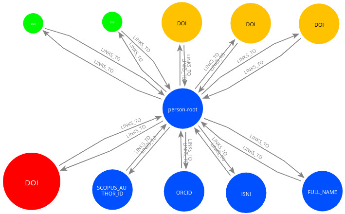
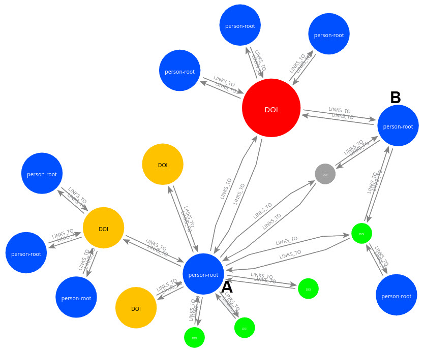

# Ricgraph - Research in context graph

## What is Ricgraph?

Ricgraph (Research in context graph) is a
[graph](https://en.wikipedia.org/wiki/Graph_theory) with
nodes (sometimes called vertices)
and edges (sometimes called links) to represent objects and their relations.
It can be used to store, manipulate and read metadata of any object that
has a relation to another object,
as long as every object can be "represented" by at least a *name* and a *value*.
In Ricgraph, one node represents one object, and an edge represents the
relation between two objects.
It is written in Python and uses [Neo4j](https://neo4j.com)
as [graph database engine](https://en.wikipedia.org/wiki/Graph_database).

Metadata of an object are stored as "properties"
in a node, i.e. as information associated with a node.
For example, a node may store two properties, *name = PET* and
*value = cat*. Another node may store *name = FULL_NAME* and *value = John Doe*.
Then the edge between those two nodes means that the person with FULL_NAME John Doe
has a PET which is a cat.

The philosophy of Ricgraph is that it stores metadata, not the objects the metadata
refer to. To access an object, a node has a link to that object in
the system it was obtained from. The objective is to get metadata from
objects from a source system in a process called "harvesting".
All information harvested from several source systems will be combined into one graph.
Modification of metadata of an object is
done in the source system the object was
harvested from, and then reharvesting of that source system.

## Why Ricgraph?

Ricgraph has been developed because a university had a need to be able to show
people, organizations and research outputs
(e.g. books, journal articles, datasets, software, etc.)
in relation to each other. This information is stored in different systems.
That university needed to show research in context in a
graph (hence the name).
Ricgraph is able to answer questions like:

* Which person has contributed to which book, journal article, dataset,
  software package, etc.?
* Given e.g. a dataset or software package, who has contributed to it?
* What identifiers does a person have (there are a lot in use at universities)?
* Show a network of persons who have worked together?
* For what organization does a person work? So which organizations have worked together?

Ricgraph provides example code to do this. We have chosen a
graph as a datastructure, since it is a logical and efficient
method to access objects
which are close to objects they have a relation to. For example,
starting with a person, its research outputs are only one
step away by following one edge, and other contributors to that research output are
again one step (edge) away.

In the remainder of this text, Ricgraph is described in the use case of
showing people, organizations and research outputs in relation to each other
in a university context.

### Example

In the figures below, nodes in green are datasets, nodes in yellow journal articles,
nodes in red software and nodes in blue person identifiers. Small nodes are harvested from
the data repository [Yoda](https://search.datacite.org/repositories/delft.uu),
medium-sized nodes from
the [Research Information System Pure](https://www.elsevier.com/solutions/pure),
and large sized nodes from the
[Research Software Directory](https://research-software-directory.org).
Click the figures to enlarge.

| one person with several research outputs          | several persons with several research outputs        |
|---------------------------------------------------|------------------------------------------------------|
|  |  |

The left figure shows that a person has 5 identifiers (blue) and 3 journal articles (yellow)
from Pure,
2 datasets from Yoda (green) and 1 software package from the Research Software Directory (red).
*Person-root* is the central node to which everything related to a person is connected.
Information from several sources is combined in one graph.
The right figure shows a more extensive example. Two persons, A and B, have worked together on
a software package (red), a dataset (green), and something else (grey).
More examples can be found in [Ricgraph details](docs/ricgraph_details.md).

## What can Ricgraph do?

Some of Ricgraph's features are:

* Ricgraph stores metadata of objects.
  The objective is to get metadata from
  objects from a source system in a process called "harvesting".
  That means that e.g. persons and publications
  can be harvested from one system, datasets from another system, and software from a third system.
  Everything found will be combined into one graph.
* Ricgraph can harvest from many sources, and you can write your own
  harvesting scripts. Example scripts are included to
  harvest from the [Research Information System Pure](https://www.elsevier.com/solutions/pure),
  the data repository [Yoda](https://search.datacite.org/repositories/delft.uu),
  and the [Research Software Directory](https://research-software-directory.org).
* Ricgraph can be used as an ID resolver. It can, given an identifier of a person,
  easily find other identifiers of that person. When new identifiers are found when
  harvesting from new systems,
  they will be added automatically. It can form the core engine for the Dutch
  [National Roadmap for Persistent
  Identifiers](https://www.surf.nl/en/national-roadmap-for-persistent-identifiers).
* Since Ricgraph combines information from different sources in one graph, it
  can be used as a discoverer (an aggregated search engine), such as the
  [UU-discoverer](https://itforresearch.uu.nl/wiki/UU-discoverer).
  Also, it can be used as a core engine for the
  [Dutch Open Knowledge
  Base](https://communities.surf.nl/en/open-research-information/article/building-an-open-knowledge-base).
* Ricgraph can check the consistency of information harvested. For example, ORCIDs and ISNIs
  are supposed to refer to one person, so every node representing such an identifier should have
  only one edge. This can be checked easily.
  An example script is included.
* Ricgraph can enrich information. For example,
  if a person has an ORCID, but not a Scopus Author ID,
  [OpenAlex](https://openalex.org) can be used
  to find the missing ID. If something is found, it is added to the person record.
  An example script is included.
* Ricgraph can store any number of properties in a node.
  It has function calls to
  create, read (find), update and delete (CRUD) nodes and to connect two nodes.
* To query, visualize and explore the graph, 
  see [Query and visualize Ricgraph](docs/ricgraph_query_visualize.md).

## How can you use Ricgraph?

* Read more about [Ricgraph details](docs/ricgraph_details.md),
  such as example graphs, person identifiers and the *person-root* node.
* [Install and configure Ricgraph](docs/ricgraph_install_configure.md).
* Write code, or start reusing code,
  see the [Ricgraph programming examples](docs/ricgraph_programming_examples.md).
* Or [do a harvest for Utrecht University datasets and
  software](docs/ricgraph_programming_examples.md#harvest-of-utrecht-university-datasets-and-software).
  You will observe that the information from two sources is neatly combined into one graph.
* To query, visualize and explore the graph,
  see [Query and visualize Ricgraph](docs/ricgraph_query_visualize.md).
* Of course, there is [future work to do](docs/ricgraph_future_work.md). Please let me know
  if you'd like to help.

