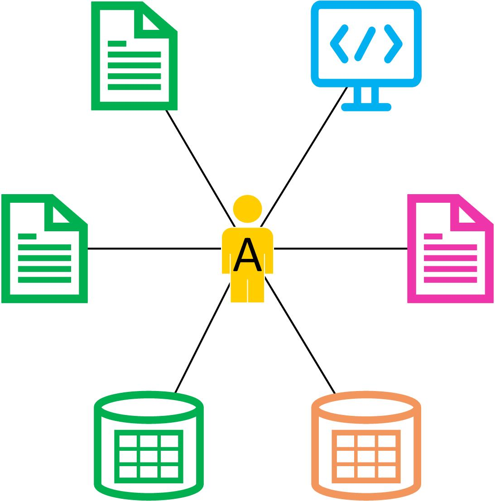
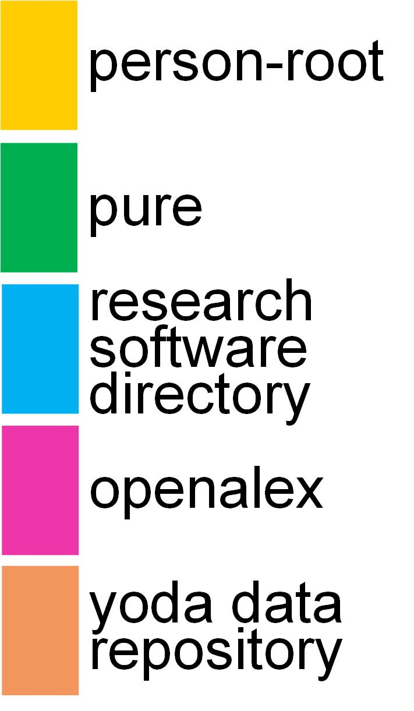

  

  

  

<!---
Note, the lines 'Website' and
'PyPI downloads' end in two spaces, to force a line break but not a paragraph break.
Similar for others.
We use color=#4c1 (green), that color is used by the 'repo status' badge.
Documentation about the Podman badges can be found here: https://github.com/eggplants/ghcr-badge.
--->

 

# Ricgraph - Research in context graph 

[Table of contents of Ricgraph documentation](docs/ricgraph_toc_documentation.md) and 
[Index of Ricgraph documentation](docs/ricgraph_index_documentation.md).

## What is Ricgraph?

Ricgraph, also known as Research in context graph, enables the exploration of researchers, 
teams, their results,
collaborations, skills, projects, and the relations between these items.

Ricgraph can store many types of items into a single graph. 
These items can be obtained from various systems and from
multiple organizations. Ricgraph facilitates reasoning about these 
items because it infers new relations between items,
relations that are not present in any of the separate source systems. 
It is flexible and extensible, and can be
adapted to new application areas.

Throughout this documentation, we illustrate how Ricgraph works by applying 
it to the application area research information. 

### Motivation

Ricgraph, also known as Research in context graph, is software that is about
relations between items. These items can be collected from various source 
systems and from multiple organizations. We
explain how Ricgraph works by applying it to the application area 
*research information*. We show the insights that can be
obtained by combining information from various source systems, 
insight arising from new relations that are not present
in each separate source system.

*Research information* is about anything related to research: research 
results, the persons in a research team, their
collaborations, their skills, projects in which they have 
participated, as well as the relations between these entities.
Examples of *research results* are publications, data sets, and software.

Example use cases from the application area research information are:

| Use case                                                                                                                                                                                                                                                        | In Ricgraph (click to enlarge)                              |
|-----------------------------------------------------------------------------------------------------------------------------------------------------------------------------------------------------------------------------------------------------------------|-------------------------------------------------------------|
| As a journalist, I want to find researchers with a certain skill S and their publications, so that I can interview them for a newspaper article. Example skills can be: *climate change* or *stem cells*.                                                       |  |
| As a librarian, I want to enrich my local research information system with research results from person A that are in other systems (in orange, *RIS2*) but not in ours (in green, *RIS1*), so that we have a more complete view of research at our university. |   |
| As a researcher A, I want to find researchers from other universities that have co-authored publications written by the co-authors of my own publications, so that I can read their publications to find out if we share common research interests.             |  |

These use cases use different types of information (called *items*):
researchers, skills, publications,
etc. Most often, these types of information are not stored in 
one system, so the use cases may be difficult or
time-consuming to answer. However, by using Ricgraph, these 
use cases (and many others) are easy to answer, as will be
explained throughout this documentation.

Although this documentation illustrates Ricgraph in the application area 
research information, the principle “relations
between items from various source systems” is general, 
so Ricgraph can be used in other application areas.

### Main contributions of Ricgraph

* Ricgraph can store many types of items in a single graph.
* Ricgraph harvests multiple source systems into a single graph.
* Ricgraph Explorer is the exploration tool for Ricgraph.
* Ricgraph facilitates reasoning about items because it infers new relations between items.
* Ricgraph can be tailored for an application area.

### How to use Ricgraph (very short)

* [Install and configure Ricgraph](docs/ricgraph_install_configure.md).
* Start harvesting data, see [Ricgraph harvest scripts](docs/ricgraph_harvest_scripts.md).
* Use [Ricgraph Explorer](docs/ricgraph_explorer.md),
  the exploration tool for Ricgraph. 
* Use the [Ricgraph REST API](docs/ricgraph_restapi.md),
  the REST API for Ricgraph.
* Optional: modify code to fit Ricgraph to your specific use case.

For more details, read the remainder of this documentation.
  
### Read more about Ricgraph

For a gentle introduction in Ricgraph, read the reference publication: 
Rik D.T. Janssen (2024). Ricgraph: A flexible and extensible graph to explore research in
context from various systems. *SoftwareX*, 26(101736).
https://doi.org/10.1016/j.softx.2024.101736.

For a further introduction, you might want to read these two presentations:
* A general presentation about Ricgraph, presenting Ricgraph in a visual manner: 
  https://doi.org/10.5281/zenodo.12634234.
* A presentation explaining how to enrich 
  the [Research Information System Pure](https://www.elsevier.com/solutions/pure)
  (and other source systems) using Ricgraph 
  and [BackToPure](https://github.com/UtrechtUniversity/BackToPure):
  https://doi.org/10.5281/zenodo.12634658.
  This presentation explains that after harvesting several Pure systems 
  (from different institutions)  and other source systems,
  such as [OpenAlex](https://openalex.org), 
  one can enrich its own Pure _A_ by using information in other source
  systems, not present in one's own Pure _A_.
  
To learn more about Ricgraph,
[read why Ricgraph has been developed](#why-ricgraph).
This is followed by
[Ricgraph in bullet points](#ricgraph-in-bullet-points). There is also
[a section with next steps you might want to take](#next-steps),
including [further information about 
Ricgraph](#further-information-about-ricgraph),
an [explanation how to install Ricgraph and harvest 
data](#steps-to-take-if-you-would-like-to-install-ricgraph-and-harvest-data),
an [explanation how to use Ricgraph](#steps-to-take-if-you-would-like-to-use-ricgraph), 
and [information about extending Ricgraph](#read-this-in-case-you-would-like-to-extend-ricgraph).
Of course there are 
[videos we have made to demonstrate Ricgraph](docs/ricgraph_example_use_videos.md),
and there is an overview of the 
[publications](docs/ricgraph_pubs_pres_news_use_ment.md#ricgraph-publications),
[presentations](docs/ricgraph_pubs_pres_news_use_ment.md#ricgraph-presentations),
[newsletters](docs/ricgraph_pubs_pres_news_use_ment.md#ricgraph-newsletters)
(to subscribe, go to [Ricgraph Contact](#contact)),
[use](docs/ricgraph_pubs_pres_news_use_ment.md#ricgraph-use), and
[mentions](docs/ricgraph_pubs_pres_news_use_ment.md#ricgraph-mentions)
of Ricgraph.

You can also use the [Table of contents of Ricgraph documentation](docs/ricgraph_toc_documentation.md) 
or the [Index of Ricgraph documentation](docs/ricgraph_index_documentation.md).

## Why Ricgraph?

Ricgraph can answer questions like:
* Which researcher has contributed to which publication, dataset, software package, project, etc.?
* Given e.g. a dataset, software package, or project, who has contributed to it?
* What identifiers does a researcher have (e.g. 
  [ORCID](https://en.wikipedia.org/wiki/ORCID), 
  [ISNI](https://en.wikipedia.org/wiki/International_Standard_Name_Identifier),
  organization employee ID, email address)?
* What skills does a researcher have?
* Show a network of researchers who have worked together?
* Which organizations have worked together?

Also, more elaborate information can be found using Ricgraph and 
[Ricgraph Explorer](docs/ricgraph_explorer.md), the
exploration tool for Ricgraph:
* You can find information about persons or their results in a (sub-)organization 
  (unit, department, faculty, university). 
  For example, you can find out what data sets or software are produced in your faculty. 
  Or the skills of all persons in your department. Of course this is only possible in case you have harvested them.
* You can find out with whom a person shares research output types. 
  For example, you can find out with whom someone shares software or data sets.
* You can get tables showing how you can enrich a source system based on other systems you have harvested. 
  For example, suppose you have harvested both 
  [Research Information System Pure](https://www.elsevier.com/solutions/pure) and
  [OpenAlex](https://openalex.org), using this feature you can find out 
  which publications in OpenAlex are not in Pure. You might want to add those to Pure.
* You can get a table that shows the overlap in harvests from different source systems. 
  For example, after a query to show all ORCID nodes, 
  the table summarizes the number of ORCID nodes which were
  only found in one source, and which were found in multiple sources. 
  Another table gives a detailed overview how many
  nodes originate from which different source systems. Then, you can drill down by 
  clicking on a number in one of these
  two tables to find the nodes corresponding to that number. 

With Ricgraph, you can get metadata from objects from any source system you’d like. 
You run the harvest script for that
system, and data will be imported in Ricgraph and will be 
combined automatically with data which is already there.
Ricgraph provides harvest scripts for the systems mentioned above. 
Scripts for other sources can be written easily.

In the remainder of this text, Ricgraph is described in the use case of
showing people, organizations and research outputs in relation to each other
in a university context.

## Examples

See the figures below for example graphs that show how Ricgraph works.
Click a figure to enlarge.

| one person with several research outputs                                  | symbols for type of object                       | colors for source system                                 |
|---------------------------------------------------------------------------|--------------------------------------------------|----------------------------------------------------------|
|  |  |  |

This figure shows one person *A* using a
[*person-root* node, a node which "represents" a person](docs/ricgraph_details.md#person-root-node-in-ricgraph)
as it is called
in Ricgraph.
This person has contributed to three articles, two data sets and one software package.
Two articles and one data set are from
the [Research Information System Pure](https://www.elsevier.com/solutions/pure)
(their color is green),
one data set is from
the data repository [Yoda](https://www.uu.nl/en/research/yoda)
(in orange), 
one article is from [OpenAlex](https://openalex.org) (in purple),
and
the software package is from the
[Research Software Directory](https://research-software-directory.org) (in blue).

| several persons with several research outputs                                  | one person with several identifiers and research outputs         |
|--------------------------------------------------------------------------------|------------------------------------------------------------------|
|  |  |

The left part of this figure shows several persons having several research outputs
(the symbols) and
how these are related (i.e. which person contributed to which research output).
It also shows from which source system these research outputs have originated
(using different colors).
The right part shows one person having several identifiers and several research outputs.
This person has two different ORCIDs, one ISNI, one SCOPUS_AUTHOR_ID, and two FULL_NAMEs (which differ
in spelling). These identifiers have also been obtained from different source systems, as their color indicates.

More examples can be found in [Ricgraph details](docs/ricgraph_details.md).

## Ricgraph in bullet points

* The philosophy of Ricgraph is that it stores metadata, not the objects the metadata
  refer to. To access an object, a node has a link to that object in
  the system it was obtained from. 
* We have chosen a
  graph as a datastructure, since it is a logical and efficient
  method to access objects
  which are close to objects they have a relation to. For example,
  starting with a person, its research outputs are only one
  step away by following one edge, and other contributors to that research output are
  again one step (edge) away.
* Ricgraph can be used to store, manipulate and read metadata of any object that
  has a relation to another object,
  as long as every object can be "represented" by at least a *name* and a *value*.
  In Ricgraph, one node represents one object, and an edge represents the
  relation between two objects.
* Ricgraph and Ricgraph Explorer are written in Python. You can use two different
  [graph database backends](https://en.wikipedia.org/wiki/Graph_database):
  * [Neo4j](https://neo4j.com) (either Neo4j Desktop or Neo4j Community Edition);
  * [Memgraph](https://memgraph.com).
* Metadata of an object are stored as "properties"
  in a node, i.e. as information associated with a node.
  For example, a node may store two properties, *name = PET* and
  *value = cat*. Another node may store *name = FULL_NAME* and *value = John Doe*.
  Then the edge between those two nodes means that the person with FULL_NAME John Doe
  has a PET which is a cat. Ricgraph can store any number of properties in a node.
* The objective of Ricgraph is to get metadata from
  objects from a source system in a process called "harvesting".
  That means that e.g. persons and publications
  can be harvested from one system, data sets from another system, and software from a third system.
  Everything found will be combined into one graph.
* Ricgraph can harvest from many sources, and you can write your own
  harvesting scripts. Example scripts are included to
  harvest from the [OpenAlex](https://openalex.org), 
  the [Research Information System Pure](https://www.elsevier.com/solutions/pure),
  the data repository [Yoda](https://www.uu.nl/en/research/yoda),
  the [Research Software Directory](https://research-software-directory.org), and 
  for the [Utrecht University staff pages](https://www.uu.nl/staff/search).
* Ricgraph can be used as an ID resolver. It can, given an identifier of a person,
  easily find other identifiers of that person. When new identifiers are found when
  harvesting from new systems,
  they will be added automatically. 
* Ricgraph can check the consistency of information harvested. For example, ORCIDs and ISNIs
  are supposed to refer to one person, so every node representing such an identifier should have
  only one edge. This can be checked easily.
  An example script is included.
* Ricgraph can enrich information in its own graph by using information from other systems. 
  For example,
  if a person has an ORCID, but not a Scopus Author ID,
  [OpenAlex](https://openalex.org) can be used
  to find the missing Scopus Author ID. An example script is included.
* Ricgraph can enrich a source system based on information that is present in one
  source system, but not in another source system. See the use case above.

## Next steps

[Table of contents of Ricgraph documentation](docs/ricgraph_toc_documentation.md) and
[Index of Ricgraph documentation](docs/ricgraph_index_documentation.md).

### Further information about Ricgraph
* For a gentle introduction in Ricgraph, read the reference publication:
  Rik D.T. Janssen (2024). Ricgraph: A flexible and extensible graph to explore research in
  context from various systems. *SoftwareX*, 26(101736).
  https://doi.org/10.1016/j.softx.2024.101736.
* For a further introduction, you might want to read these two presentations:
  * A general presentation about Ricgraph, presenting Ricgraph in a visual manner:
    https://doi.org/10.5281/zenodo.12634234.
  * A presentation explaining how to enrich
    the [Research Information System Pure](https://www.elsevier.com/solutions/pure)
    (and other source systems) using Ricgraph
    and [BackToPure](https://github.com/UtrechtUniversity/BackToPure):
    https://doi.org/10.5281/zenodo.12634658.
    This presentation explains that after harvesting several Pure systems
    (from different institutions)  and other source systems,
    such as [OpenAlex](https://openalex.org),
    one can enrich its own Pure _A_ by using information in other source
    systems, not present in one's own Pure _A_.

* Read more about
  [publications](docs/ricgraph_pubs_pres_news_use_ment.md#ricgraph-publications),
  [presentations](docs/ricgraph_pubs_pres_news_use_ment.md#ricgraph-presentations),
  [newsletters](docs/ricgraph_pubs_pres_news_use_ment.md#ricgraph-newsletters)
  (to subscribe, go to [Ricgraph Contact](#contact)),
  [use](docs/ricgraph_pubs_pres_news_use_ment.md#ricgraph-use), and
  [mentions](docs/ricgraph_pubs_pres_news_use_ment.md#ricgraph-mentions)
  of Ricgraph.
* Look at the [videos we have made to demonstrate Ricgraph](docs/ricgraph_example_use_videos.md).
* Read more about [Ricgraph details](docs/ricgraph_details.md),
  such as example graphs, person identifiers and the *person-root* node.
* You might want to [compare Ricgraph to other systems](docs/ricgraph_comparison.md).

### Steps to take if you would like to install Ricgraph and harvest data
* [Install and configure Ricgraph](docs/ricgraph_install_configure.md).
* Start harvesting data, see [Ricgraph harvest scripts](docs/ricgraph_harvest_scripts.md),
  e.g. by doing a harvest for Utrecht University data sets and
  software. 
  You will observe that the information from two sources is neatly combined into one graph.
* Unfortunately, there is a bug, see [known bugs](docs/ricgraph_known_bugs.md).
  This bug may occur
  if you start a harvest script, and as first step in the script you want to empty Ricgraph.
  In that case, a Python error might occur while emptying Ricgraph. Follow the link
  to read more and find out how to repair that.

### Steps to take if you would like to use Ricgraph
* First, install Ricgraph (see above).
* Use [Ricgraph Explorer](docs/ricgraph_explorer.md),
  the exploration tool for Ricgraph. 
* Use the [Ricgraph REST API](docs/ricgraph_restapi.md),
  the REST API for Ricgraph.
* Alternatively, you might want to read
  [Query and visualize Ricgraph](docs/ricgraph_query_visualize.md).

### Read this in case you would like to extend Ricgraph
* Start writing scripts, see [Ricgraph script writing](docs/ricgraph_script_writing.md).
* Of course, there is [future work to do](docs/ricgraph_future_work.md). Please let me know
  if you'd like to help.

### Ricgraph website
Ricgraph has a main Ricgraph website on www.ricgraph.eu. 
Alternative sites are www.ricgraph.nl and www.ricgraph.com.
The sources for this website are on GitHub in repository
https://github.com/UtrechtUniversity/ricgraph-website.

## Contact
Ricgraph has been created and is being maintained by 
[Rik D.T. Janssen from Utrecht University in the Netherlands](https://www.uu.nl/staff/DTJanssen)
[(ORCID 0000-0001-9510-0802)](https://orcid.org/0000-0001-9510-0802).
You can contact him for presentations, demos and workshops.

About three to four times a year we send out a 
newsletter.
[Please click here to subscribe to it. Your email program will open with
a subscribe email text. Please complete it
by filling in your name and email address](mailto:r.d.t.janssen@uu.nl?subject=Please%20add%20me%20to%20the%20Ricgraph%20newsletter%20email%20list&body=Hi%20Rik%2C%0D%0A%0D%0ACan%20you%20please%20add%20me%20to%20your%20Ricgraph%20newsletter%20email%20list%3F%20Thanks!%0D%0A%0D%0ABest%20regards%2C%0D%0A%0D%0A%5Bplease%20replace%20with%20your%20name%5D%0D%0A%5Bplease%20replace%20with%20your%20email%20address%5D).
We also have a 
[newsletter archive](docs/ricgraph_pubs_pres_news_use_ment.md#ricgraph-newsletters). 

If you like Ricgraph, please give it a GitHub Star by clicking on the top right 
*Star* button on this page. If you have any suggestions or improvements, 
please let me know by creating a GitHub *Issue* at the top left of this page. 
