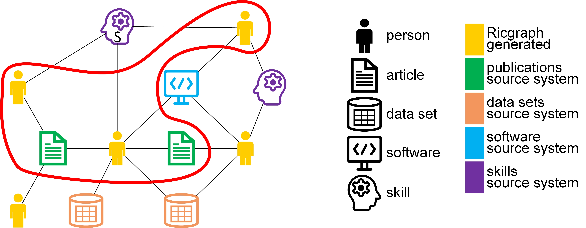

  

  

<!---
Note, the lines 'DOI reference publication' and
'GitHub last commit' end in two spaces, to force a line break but not a paragraph break.
--->
 

# Ricgraph - Research in context graph 

## What is Ricgraph?

What if... we look at research information as a graph? We would have relations 
between objects, we would be able to “walk”
from one object to another, and related objects would be neighbors. 
For example, starting with a researcher, the publications
of this person are only one step away by following one edge, 
and other contributors to that publication are again
one step (edge) away.

With Ricgraph, you can create a 
[graph](https://en.wikipedia.org/wiki/Graph_theory)
from research information that
is stored in various source systems. You can
explore this graph and discover relations you were not aware of. 
We have developed Ricgraph (Research in context graph)
because our university had a need to be able to show our researchers, 
their skills, (child) organizations (e.g. unit, department, faculty, university),
projects and research outputs (e.g. publications, 
datasets, software packages) in relation to each other.
This information is stored in different systems, such as Pure, OpenAlex, Yoda, 
the Research Software Directory, and our
organization’s employee pages.

By combining this information in one graph, it is possible to show 
research in context (hence the name). Ricgraph is a
graph that uses nodes and edges to represent objects and their relations. 
It can be used to store, manipulate and read
metadata of any object that has a relation to another object.

Example use cases for Ricgraph are:
* As a journalist, I want to find researchers with a certain skill 
  and their publications, so that I can interview them for a newspaper article.
* As a librarian, I want to enrich my local research information system 
  with research results that are in other systems but not in ours, 
  so that we have a more complete view of research at our university.
* As a researcher, I want to find researchers from other universities 
  that have co-authored publications written by the co-authors 
  of my own publications, so that I can read their publications 
  to find out if we share common research interests.

Read section
[Example use cases in Ricgraph](#example-use-cases-in-ricgraph)
to find out how these use cases work out using Ricgraph.

To learn more about Ricgraph,
[read why Ricgraph has been developed](#why-ricgraph), including
[examples](#examples). This is followed by
[Ricgraph in bullet points](#ricgraph-in-bullet-points). There is also
[a section with next steps you might want to take](#next-steps).
You can also look at
the [videos we have made to demonstrate Ricgraph](docs/ricgraph_example_use_videos.md),
or the [publications, presentations, use and mentions of Ricgraph](docs/ricgraph_pubs_presentations_use_mentions.md).

Reference publication: Rik D.T. Janssen, 
*Ricgraph: A Flexible and Extensible Graph to Explore Research in Context 
from Various Systems*. January 2024. Submitted to SoftwareX. 
https://doi.org/10.2139/ssrn.4712466.

## Why Ricgraph?

Ricgraph can answer questions like:
* Which researcher has contributed to which publication, dataset, software package, project, etc.?
* Given e.g. a dataset, software package, or project, who has contributed to it?
* What identifiers does a researcher have (e.g. ORCID, ISNI, organization employee ID, email address)?
* What skills does a researcher have?
* Show a network of researchers who have worked together?
* Which organizations have worked together?

Also, more elaborate information can be found using Ricgraph and 
[Ricgraph Explorer](docs/ricgraph_explorer.md), the
exploration tool for Ricgraph:
* You can find information about persons or their results in a (child) 
  organization (unit, department, faculty, university). 
  For example, you can find out what data sets or software are produced in your faculty. Or the skills of all persons in your department. Of course this is only possible in case you have harvested them.
* You can find out with whom a person shares research output types. 
  For example, you can find out with whom someone shares software or data sets.
* You can get tables showing how you can enrich a source system based on other systems you have harvested. For example, suppose you have harvested both Pure and OpenAlex, using this feature you can find out which publications in OpenAlex are not in Pure. You might want to add those to Pure.
* You can get a table that shows the overlap in harvests from different source systems. 
  For example, after a query to show all ORCID nodes, 
  the table summarizes the number of ORCID nodes which were
  only found in one source, and which were found in multiple sources. 
  Another table gives a detailed overview how many
  nodes originate from which different source systems. Then, you can drill down by 
  clicking on a number in one of these
  two tables to find the nodes corresponding to that number. 

With Ricgraph, you can get metadata from objects from any source system you’d like. 
You run the harvest script for that
system, and data will be imported in Ricgraph and will be 
combined automatically with data which is already there.
Ricgraph provides harvest scripts for the systems mentioned above. 
Scripts for other sources can be written easily.

In the remainder of this text, Ricgraph is described in the use case of
showing people, organizations and research outputs in relation to each other
in a university context.

## Example use cases in Ricgraph

### Use case 1, as a journalist...
As a journalist, I want to find researchers with
skill S and their publications, so that I can interview them for a newspaper article.
Example skills can be: *climate change* or *stem cells*.

 

### Use case 2, as a librarian...
As a librarian, for researcher A, I want to enrich my
local research information system *RIS1* with identities and
research results that are in other systems but not in ours,
so that we have a more complete view of research at
our university.

 

### Use case 3, as a researcher...
As researcher A, I want to find researchers from other universities
that have co-authored publications written by the co-authors
of my own publications, so that I can read their publications
to find out if we share common research interests.

## Examples

See the figures below for example graphs that show how Ricgraph works.
Click a figure to enlarge.

| one person with several research outputs                                  | symbols for type of object                       | colors for source system                                 |
|---------------------------------------------------------------------------|--------------------------------------------------|----------------------------------------------------------|
|  |  |  |

This figure shows one person *A* using a
[*person-root* node, a node which "represents" a person](docs/ricgraph_details.md#person-root-node-in-ricgraph)
as it is called
in Ricgraph.
This person has contributed to three articles, two data sets and one software package.
Two articles and one data set are from
the [Research Information System Pure](https://www.elsevier.com/solutions/pure)
(their color is green),
one data set is from
the data repository [Yoda](https://search.datacite.org/repositories/delft.uu)
(in orange), 
one article is from [OpenAlex](https://openalex.org) (in purple),
and
the software package is from the
[Research Software Directory](https://research-software-directory.org) (in blue).

| several persons with several research outputs                                  | one person with several identifiers and research outputs         |
|--------------------------------------------------------------------------------|------------------------------------------------------------------|
|  |  |

The left part of this figure shows several persons having several research outputs
(the symbols) and
how these are related (i.e. which person contributed to which research output).
It also shows from which source system these research outputs have originated
(using different colors).
The right part shows one person having several identifiers and several research outputs.
This person has two different ORCIDs, one ISNI, one SCOPUS_AUTHOR_ID, and two FULL_NAMEs (which differ
in spelling). These identifiers have also been obtained from different source systems, as their color indicates.

More examples can be found in [Ricgraph details](docs/ricgraph_details.md).

## Ricgraph in bullet points

* The philosophy of Ricgraph is that it stores metadata, not the objects the metadata
  refer to. To access an object, a node has a link to that object in
  the system it was obtained from. 
* We have chosen a
  graph as a datastructure, since it is a logical and efficient
  method to access objects
  which are close to objects they have a relation to. For example,
  starting with a person, its research outputs are only one
  step away by following one edge, and other contributors to that research output are
  again one step (edge) away.
* Ricgraph is a graph with
  nodes (sometimes called vertices)
  and edges (sometimes called links) to represent objects and their relations.
  It can be used to store, manipulate and read metadata of any object that
  has a relation to another object,
  as long as every object can be "represented" by at least a *name* and a *value*.
  In Ricgraph, one node represents one object, and an edge represents the
  relation between two objects.
  It is written in Python and uses [Neo4j](https://neo4j.com)
  as [graph database engine](https://en.wikipedia.org/wiki/Graph_database).
* Metadata of an object are stored as "properties"
  in a node, i.e. as information associated with a node.
  For example, a node may store two properties, *name = PET* and
  *value = cat*. Another node may store *name = FULL_NAME* and *value = John Doe*.
  Then the edge between those two nodes means that the person with FULL_NAME John Doe
  has a PET which is a cat.
* The objective of Ricgraph is to get metadata from
  objects from a source system in a process called "harvesting".
  That means that e.g. persons and publications
  can be harvested from one system, data sets from another system, and software from a third system.
  Everything found will be combined into one graph.
* Ricgraph can harvest from many sources, and you can write your own
  harvesting scripts. Example scripts are included to
  harvest from the [OpenAlex](https://openalex.org), 
  the [Research Information System Pure](https://www.elsevier.com/solutions/pure),
  the data repository [Yoda](https://search.datacite.org/repositories/delft.uu),
  the [Research Software Directory](https://research-software-directory.org), and 
  for the [Utrecht University staff pages](https://www.uu.nl/staff/search).
* Ricgraph can be used as an ID resolver. It can, given an identifier of a person,
  easily find other identifiers of that person. When new identifiers are found when
  harvesting from new systems,
  they will be added automatically. 
* Since Ricgraph combines information from different sources in one graph, it
  can be used as a discoverer (an aggregated search engine).
* Ricgraph can check the consistency of information harvested. For example, ORCIDs and ISNIs
  are supposed to refer to one person, so every node representing such an identifier should have
  only one edge. This can be checked easily.
  An example script is included.
* Ricgraph can enrich information. For example,
  if a person has an ORCID, but not a Scopus Author ID,
  [OpenAlex](https://openalex.org) can be used
  to find the missing ID. If something is found, it is added to the person record.
  An example script is included.
* Ricgraph can store any number of properties in a node.
  It has function calls to
  create, read (find), update and delete (CRUD) nodes and to connect two nodes.
* To query, visualize and explore the graph, 
  see [Query and visualize Ricgraph](docs/ricgraph_query_visualize.md).

## Next steps

* Read more about [Ricgraph details](docs/ricgraph_details.md),
  such as example graphs, person identifiers and the *person-root* node.
* Read more about [Ricgraph Explorer](docs/ricgraph_explorer.md),
  the exploration tool for Ricgraph. 
* Look at the [videos we have made to demonstrate Ricgraph](docs/ricgraph_example_use_videos.md).
* You might want to [compare Ricgraph to other systems](docs/ricgraph_comparison.md).
* [Install and configure Ricgraph](docs/ricgraph_install_configure.md).
* Start harvesting data, see [Ricgraph harvest scripts](docs/ricgraph_harvest_scripts.md),
  e.g. by doing a harvest for Utrecht University data sets and
  software. 
  You will observe that the information from two sources is neatly combined into one graph.
* Start writing scripts, see [Ricgraph script writing](docs/ricgraph_script_writing.md).
* To query, visualize and explore the graph,
  see [Query and visualize Ricgraph](docs/ricgraph_query_visualize.md).
* Unfortunately, there is a bug, see [known bugs](docs/ricgraph_known_bugs.md).
  This bug may occur
  if you start a harvest script, and as first step in the script you want to empty Ricgraph.
  In that case, a Python error might occur while emptying Ricgraph. Follow the link
  to read more and find out how to repair that.
* Of course, there is [future work to do](docs/ricgraph_future_work.md). Please let me know
  if you'd like to help.

