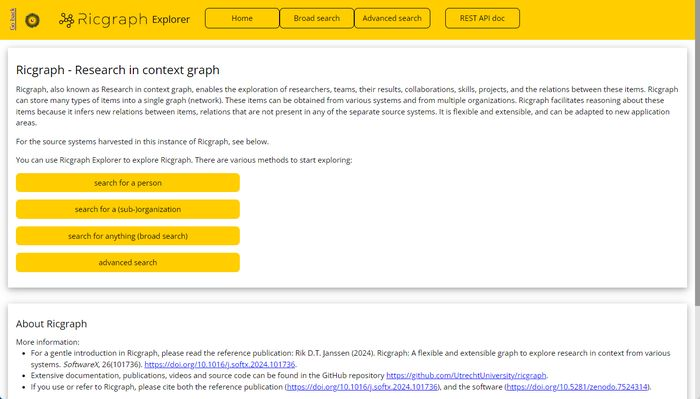
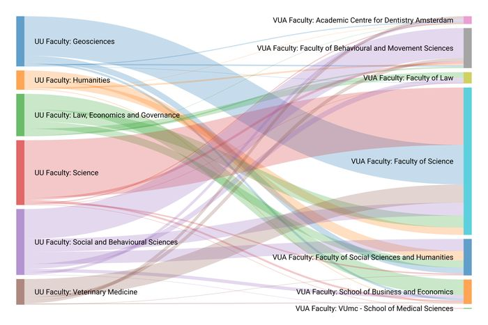
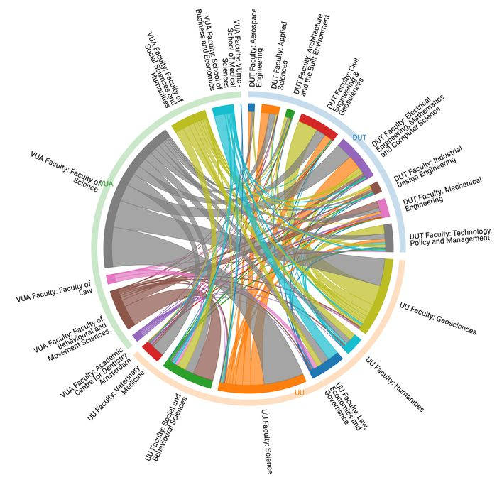

**Subject:**    Ricgraph newsletter October 2025

**Sent:**   Wednesday, 1 October 2025 08:18

---

Dear colleague,

This newsletter tells you about some recent developments around Ricgraph. 
You can find the following information:

* What is Ricgraph.
* Pilot project Open Ricgraph demo server is operational.
* New article: Utilizing Ricgraph to gain insights into research collaborations across institutions.
* Ricgraph projects with students.
* Contouren open science infrastructuur.
* Other information that might be of interest.

If you would like to have a presentation or demo, or would like to discuss how
Ricgraph can help you for your specific use case, please do not hesitate to
contact me. Please feel free to share this newsletter with anyone you might
think is interested. 

**What is Ricgraph**

Ricgraph ([www.ricgraph.eu](https://www.ricgraph.eu)),
also known as Research in context graph, enables
the exploration of researchers, teams, their results, collaborations, skills,
projects, and the relations between these items.

Ricgraph can store many types of items into a single graph. These items can be
obtained from various systems and from multiple organizations. Ricgraph
facilitates reasoning about these items because it infers new relations between
items, relations that are not present in any of the separate source systems.
Ricgraph is flexible and extensible, and can be adapted to new application
areas.

**Pilot project Open Ricgraph demo server is operational**

The pilot project Open Ricgraph demo server is now operational! It is filled
with research information from Delft University of Technology (thanks!), and
you can access it on 
[https://explorer.ricgraph.eu](https://explorer.ricgraph.eu).

The aim of this pilot is to demonstrate how a knowledge graph can provide
insights into research relations and collaborations, and how it can optimize
the quality of research information. We will focus on: 

* Participating
  organizations can enrich Pure data using Ricgraph and BackToPure. BackToPure
  can insert (enrich) items from an organization that are absent from the Pure of
  that organization but are present in another source, back into the Pure of that
  organization.
* Participating organizations can explore collaborations between 
  sub-organizations (faculties, departments, chairs) using Ricgraph. Also 
  see the article below.

To read more: _Discovering insights from cross-organizational research
information and collaborations: A pilot project using Ricgraph_, Rik D.T.
Janssen (2025), 
[https://doi.org/10.5281/zenodo.15637647](https://doi.org/10.5281/zenodo.15637647). 

The Open Ricgraph demo
server can also contain research information from your organization! I have
already invited three other Dutch universities. To learn how to participate,
please read
[https://www.ricgraph.eu/pilot-project-open-ricgraph-demo-server.html](https://www.ricgraph.eu/pilot-project-open-ricgraph-demo-server.html) or contact
me.

**New article: Utilizing Ricgraph to gain insights into research collaborations across institutions**

_Overview of publication collaborations (2022 – July 2025) between UU faculties
and VUA faculties. It has a total of 1139 collaborations._

Last week I have submitted a new article to PLOS One: Rik D.T. Janssen (2025),
_Utilizing Ricgraph to gain insights into research collaborations across
institutions, at every organizational level_. You can find the preprint on:
[https://doi.org/10.2139/ssrn.5524439](https://doi.org/10.2139/ssrn.5524439). 

_Abstract_ 

"In a research organization, researchers rarely work alone. They work with
colleagues from their own and other organizations, often across
multidisciplinary boundaries. That means that there are a lot of collaborations
between persons and organizations, on various levels, within and between
research organizations. This article describes methods and software that can be
used to drill down on these collaborations and find their research results,
their sub-organizations, or the persons that contributed to them.

Researchers can use information about their partnerships to see with which
groups they do and do not work together. This can help them strengthen existing
collaborations or initiate promising new ones. They can assess the
state-of-the-art in a research discipline. For management, partnerships may
reveal insights in the diversity and multidisciplinarity of research within
their organization. Diversity and multidisciplinary are key indicators of
innovation, creativity, performance, talent attraction, reputation, and
societal impact.

In this article, we use Ricgraph (Research in context graph), software that
enables the exploration of all kinds of research information, as well as the
relations between these items. It combines data from various systems and
multiple organizations, and stores it in a single graph. This design allows to
infer new relations, relations that are not present in any of the separate
source systems. As a result, a wider variety of analytical approaches can be
supported than would be possible with data from one source system."

The published article will include interactive figures for Figs 6 – 11 that you
can browse and hover with your web browser. They are listed as “Supporting
information”. I was not able to upload them to the preprint server. Please send
me an email if you would like to have them.

_Overview of publication collaborations (2022 – July 2025) between faculties of
UU, VUA, and DUT._

[For larger versions of these figures, please read the preprint.]

**Ricgraph projects with students**

There are several projects with the University of applied sciences Utrecht
(HU). At the moment, there is one student project running, two projects are in
the approval phase, and one will start in October.  

* A “innovation project”
  with six 3rd and 4th years students, for 5 months: General harvester for
  Ricgraph.
* A 3rd year internship (“stage”), for 5 months: Development of a modern frontend-backend user interface for Ricgraph.
* A 4th year graduation project (“afstudeerproject”), for 5 months: Using AI and LLM techniques to find topics and visualize large amounts of research information.
* A 2nd year short project, for a few weeks: Security scan of Ricgraph.

All of these projects will have (do have) a project description at
[https://docs.ricgraph.eu/docs/ricgraph_outreach.html#ricgraph-projects-with-students](https://docs.ricgraph.eu/docs/ricgraph_outreach.html#ricgraph-projects-with-students).
For the first project, the description can already be read. The other project
descriptions will be added when they have been approved and started.

**Contouren open science infrastructuur**

[Parts of this section will be in Dutch.]
In August, the “Landelijk overleg Open Science” has published the document:
Contouren open science infrastructuur, Strategisch plan integrale
infrastructuur voor open science deel 1 [in Dutch]. Thanks to FW who brought
this to my attention!  Read more at:
[https://www.universiteitenvannederland.nl/actueel/nieuws/denk-mee-over-de-nederlandse-open-science-infrastructuur](https://www.universiteitenvannederland.nl/actueel/nieuws/denk-mee-over-de-nederlandse-open-science-infrastructuur).
Download the report from
[https://www.universiteitenvannederland.nl/files/publications/SPII%20Deel%201%20Versie%201.0_0.pdf](https://www.universiteitenvannederland.nl/files/publications/SPII%20Deel%201%20Versie%201.0_0.pdf).

Its aim is:

“Het doel van het Strategisch Plan Integrale Infrastructuur Open Science (SPII)
is het ontwikkelen van een plan voor een samenhangende, federatieve
infrastructuur die onderzoekers en instellingen ondersteunt bij het faciliteren
van Open Science. De aanleiding is het ontbreken van een gemeenschappelijk
kader voor een Open Science Infrastructuur (OSI), hetgeen het risico van
versnippering met zich meebrengt. SPII beoogt een gemeenschappelijk gedragen
streefbeeld en streefarchitectuur te ontwikkelen dat een sturende en
harmoniserende werking heeft zodat er stapsgewijs een adequate, landelijke Open
Science Infrastructuur kan worden gerealiseerd. […]

Beschrijving open science infrastructuur componenten:

1. Research administratie en compliance met regelgeving.
2. Optimalisatie- en efficiëntieslag CRIS/repositories en inzet als publicatiekanaal.
3. Infrastructuur delen en hergebruik (sensitieve) onderzoeksdata.
4. Infrastructuur delen en hergebruik research software.
5. Open research informatie, discovery en actieve disseminatie."

2 is about Optimalisatie en efficiëntieverbetering van de huidige
CRIS/repository systemen, Inzetten van de CRIS/repositories infrastructuur als
publicatiekanaal, Institutionele CRIS systemen en een nationaal repository,
Archivering en long-term preservation, and Beschikbaarstelling voor breed
publiek (p. 25-26).  

5 is about Tellers en metrics, Metadatahub, Discovery
layer, and Actieve disseminatie (p. 33-34).

I think Ricgraph can be used to help realize parts of components 2 and 5. For
optimization of CRIS systems, Ricgraph can enhance information in one CRIS,
based on other information sources (using BackToPure and the external
organization cleaning tools that are being developed, see www.ricgraph.eu), and
it of course has a user interface (that surely needs to be enhanced for “het
brede publiek”). It can help with research assessment (for an example see the
article above). Most of this is possible because Ricgraph combines data from
various systems and multiple organizations, and stores it in a single graph.
This design allows to infer new relations, relations that are not present in
any of the separate source systems.

We will try to help realize the open science infrastructure.

**Other information that might be of interest**

* Website: [https://www.ricgraph.eu](https://www.ricgraph.eu). 
* Documentation website: [https://docs.ricgraph.eu](https://docs.ricgraph.eu). 
* Reference publication: Rik D.T. Janssen (2024). _Ricgraph: A flexible and
  extensible graph to explore research in context from various systems_.
  SoftwareX, 26(101736). 
  [https://doi.org/10.1016/j.softx.2024.101736](https://doi.org/10.1016/j.softx.2024.101736).
* Ricgraph is now on version v3.0. To see a full overview of all changes, go to
  the releases page: [https://github.com/UtrechtUniversity/ricgraph/releases](https://github.com/UtrechtUniversity/ricgraph/releases).

If you would like to have a presentation or demo, or would like to discuss how
Ricgraph can help you for your specific use case, please do not hesitate to
contact me. Please feel free to share this newsletter with anyone you might
think is interested. 

_This newsletter has been sent to you because we have had a previous
communication about Ricgraph. Please let me know if you would like to be
removed from this list (or if you want to be added to it, if someone forwarded
it to you). There will be about 2 to 3 newsletters per year about Ricgraph._

To subscribe to the newsletter email list, go to [Ricgraph Contact](../../README.md#contact).

