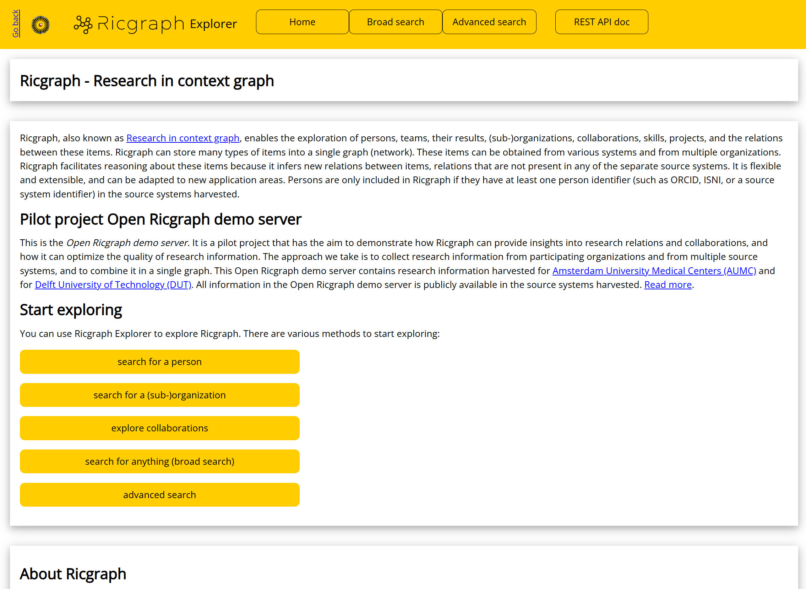
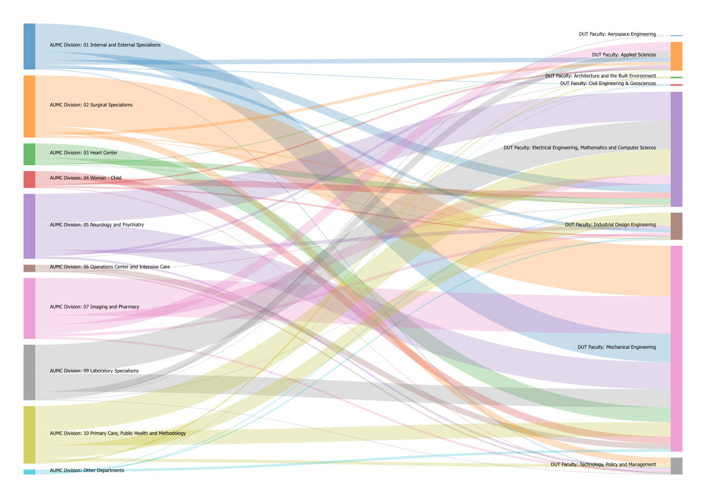
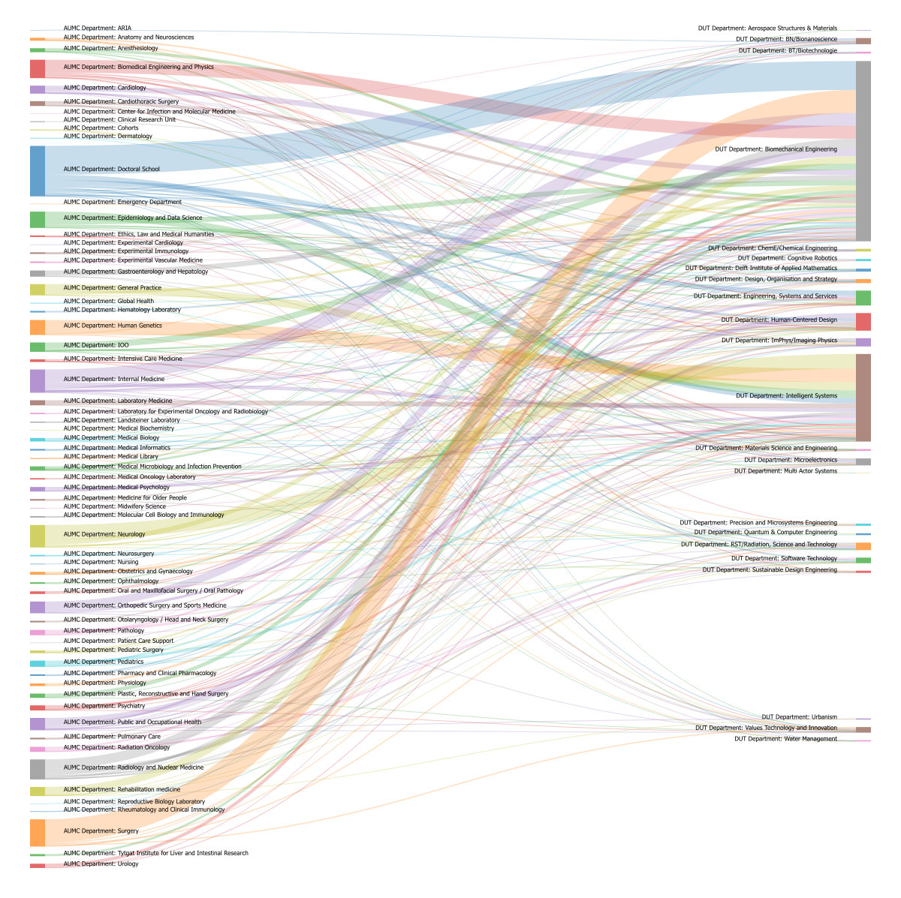
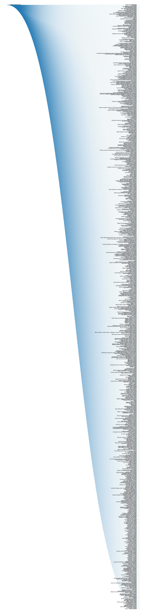

**Subject:**    Ricgraph newsletter March 2026

**Sent:**   Wednesday, March 3, 2026

---

Dear colleague,

This newsletter tells you about some recent developments around Ricgraph. You can find the following information:

* What is Ricgraph.
* Pilot project Open Ricgraph demo server now has research information from both AUMC and DUT.
* Gain insights into research collaborations across institutions.
* Ricgraph for open science monitoring.
* Ricgraph projects with students.
* Other information that might be of interest.

If you would like to have a presentation or demo, or would like to discuss how
Ricgraph can help you for your specific use case, please do not hesitate to
contact me. Please feel free to share this newsletter with anyone you might
think is interested.

**What is Ricgraph**

Ricgraph ([www.ricgraph.eu](https://www.ricgraph.eu)),
also known as Research in context graph, enables
the exploration of researchers, teams, their results, collaborations, skills,
projects, and the relations between these items.

Ricgraph can store many types of items into a single graph. These items can be
obtained from various systems and from multiple organizations. Ricgraph
facilitates reasoning about these items because it infers new relations between
items, relations that are not present in any of the separate source systems.
Ricgraph is flexible and extensible, and can be adapted to new application
areas.

From February 2026, Ricgraph also has press/media items and data sets/software from Pure (in case you harvest Pure).

**Pilot project Open Ricgraph demo server now has research information from both AUMC and DUT**

We have just added research information from the Amsterdam University Medical Centers (AUMC) to the Open Ricgraph demo
server. Since it already contained research information from Delft University of Technology (DUT), it now contains two
organizations. This means that you can explore research information from both organizations, how it relates to each
other, and e.g. explore the collaborations between them on all organizational levels (also see the next section). There
are talks with other organizations to participate, on which we will report in following newsletters. If your
organization would also like to participate, please contact me.

You can access the Open Ricgraph demo server on 
[https://explorer.ricgraph.eu](https://explorer.ricgraph.eu), 
and discover all of this for yourself.

The aim of this pilot is to demonstrate how a knowledge graph can provide
insights into research relations and collaborations, and how it can optimize
the quality of research information. We will focus on: 

* Participating
  organizations can enrich Pure data using Ricgraph and BackToPure. BackToPure
  can insert (enrich) items from an organization that are absent from the Pure of
  that organization but are present in another source, back into the Pure of that
  organization.
* Participating organizations can explore collaborations between
  sub-organizations (faculties, departments, chairs) using Ricgraph. Also
  see the article below.

To read more: _Discovering insights from cross-organizational research
information and collaborations: A pilot project using Ricgraph_, Rik D.T.
Janssen (2025),
[https://doi.org/10.5281/zenodo.15637647](https://doi.org/10.5281/zenodo.15637647).
To learn how to participate, please read
[https://www.ricgraph.eu/pilot-project-open-ricgraph-demo-server.html](https://www.ricgraph.eu/pilot-project-open-ricgraph-demo-server.html) or contact
me.

**Gain insights into research collaborations across institutions**

In the 
[Ricgraph October 2025 newsletter](https://docs.ricgraph.eu/docs/newsletters/251000-Ricgraph_newsletter_Oct_2025.html), 
I reported on the preprint: 
Rik D.T. Janssen (2025),
_Utilizing Ricgraph to gain insights into research collaborations across
institutions, at every organizational level_. You can find it on:
[https://doi.org/10.2139/ssrn.5524439](https://doi.org/10.2139/ssrn.5524439).
Since we now have two organizations in the Open Ricgraph demo server, you can explore collaborations on all
organizational levels for yourself. This section will show some examples.

_Overview of publication collaborations (2022 – February 2026) between AUMC Divisions and DUT faculties. It has a total
of 968 collaborations.
[Click to enlarge](https://docs.ricgraph.eu/docs/newsletters/260300-publications-AUMC-div-and-DUT-fac.jpg).
Create this figure for yourself: go to 
[https://explorer.ricgraph.eu/collabspage/](https://explorer.ricgraph.eu/collabspage/), 
type “AUMC Division” in the first textbox, “DUT Faculty” in the second
textbox, and “publication_all” in the third textbox._

_Overview of publication collaborations (2022 – February 2026) between AUMC Departments and DUT Departments. It has a
total of 1369 collaborations. 
[Click to enlarge](https://docs.ricgraph.eu/docs/newsletters/260300-publications-AUMC-dep-and-DUT-dep.jpg).
Create this figure for yourself: go to 
[https://explorer.ricgraph.eu/collabspage/](https://explorer.ricgraph.eu/collabspage/), 
type “AUMC Department” in the first textbox, “DUT Department” in the
second textbox, and “publication_all” in the third textbox._

Note that collaboration figures can get quite large:

_Overview of data set collaborations (2022 – February 2026) between AUMC Amsterdam UMC and other organizations. It has a
total of 3448 collaborations. 
[Click to enlarge](https://docs.ricgraph.eu/docs/newsletters/260300-datasets-AUMC-and-other-orgs.jpg).
Create this figure for yourself: go to
[https://explorer.ricgraph.eu/collabspage/](https://explorer.ricgraph.eu/collabspage/), 
type “AUMC Amsterdam UMC” in the first textbox, leave the second textbox
empty, and type “data sets” in the third textbox._

***Computation time for collaborations in Ricgraph***

It is quite computationally intensive to compute collaborations. That means, that you might need to wait quite a while
to be able to see figures like the ones above. Why is this the case?

The pattern to search for in the graph looks like this: 
start organization node --> person node --> research output node -->
person node --> collaborating organization node.

Imagine you would like to have all collaborations of AUMC with other organizations for all publication types (that is,
journal articles, books, book chapters, preprints, etc.). Technically, a search for AUMC Amsterdam UMC will be done to
find the first node. Then, from this node, all person nodes connected to it are to be visited (they are one node away
from AUMC Amsterdam UMC, there are 37056 persons connected to AUMC). From each of these person nodes, all of their
neighbors have to be examined to find all of their publication research output types that match “all publication
types” (now the number of nodes basically explodes). From each of these research output nodes, the collaborating author
nodes have to be found (even more nodes will be found, especially if a publication has a lot of authors, and if there
are a lot of publications with a lot of authors). Next, from all of these collaborating author nodes, their organization
nodes have to be found. Following that, all duplicate nodes need to be filtered out, and a collaboration matrix has to
be made.

For collaborations between AUMC Divisions and DUT faculties, the process is similar, but in this case, this process has
to be repeated for all 10 AUMC divisions, and, in the final step, all nodes found need to be filtered for all 8 DUT
faculties. So while the exploding in nodes is less, there is a lot more filtering necessary.

Figure 5 in the preprint above
([https://doi.org/10.2139/ssrn.5524439](https://doi.org/10.2139/ssrn.5524439))
shows examples of collaborations Ricgraph.

**Ricgraph for open science monitoring**

With some colleagues of Utrecht University, we have created a small informal group to create and explore (open) open
science monitoring indicators. We will build them into Ricgraph, so that we (and anyone else) can try them out using the
Open Ricgraph demo server. In doing so, we can explore their usefulness and ease of implementation using real world (
open) data.

Our group does not pretend to create the “best” or “correct” indicators, our aim is to build something that is open and
accessible to anyone, and to investigate how it performs. We have chosen this approach since there are other groups that
are more into finding good indicators, such as the Open science monitoring initiative (
OSMI)
([https://open-science-monitoring.org](https://open-science-monitoring.org)), 
the Dutch open science monitor 
([https://doi.org/10.5281/zenodo.17348592](https://doi.org/10.5281/zenodo.17348592)),
the Chiefs of Open Science UNL that are working on a common vision on publication culture, etc.

**Ricgraph projects with students**

At the moment, there are three projects with students from the University of 
applied sciences Utrecht (HU) and Utrecht University (UU):

* A 4th year HU graduation project (“afstudeerproject”), for 5 months: Using AI and LLM techniques to find topics and
  visualize large amounts of research information. This project will create topics in Ricgraph, that can be used e.g. to
  group persons or research results, or to find colleagues in similar research areas.
* A 3rd year UU Computer science Software project, for 5 months: Research AI. This project will create a chatbot that
  allows to explore research information.
* A 4th year HU graduation project (“afstudeerproject”), for 5 months: Development of a modern frontend-backend user
  interface for Ricgraph. This project will create a user interface with reusable components.

All of these projects do have a project description at 
[https://docs.ricgraph.eu/docs/ricgraph_outreach.html#ricgraph-projects-with-students](https://docs.ricgraph.eu/docs/ricgraph_outreach.html#ricgraph-projects-with-students).

**Other information that might be of interest**

* Website: [https://www.ricgraph.eu](https://www.ricgraph.eu).
* Documentation website: [https://docs.ricgraph.eu](https://docs.ricgraph.eu).
* Reference publication: Rik D.T. Janssen (2024). _Ricgraph: A flexible and
  extensible graph to explore research in context from various systems_.
  SoftwareX, 26(101736).
  [https://doi.org/10.1016/j.softx.2024.101736](https://doi.org/10.1016/j.softx.2024.101736).
* Rik D.T. Janssen (2025), Utilizing Ricgraph to gain insights into research 
  collaborations across institutions, at every organizational level. Preprint.
  [https://doi.org/10.2139/ssrn.5524439](https://doi.org/10.2139/ssrn.5524439).
* Participate in the Open Ricgraph demo server, 
  [https://www.ricgraph.eu/pilot-project-open-ricgraph-demo-server.html](https://www.ricgraph.eu/pilot-project-open-ricgraph-demo-server.html).
* Read more about our outreach activities on 
  [https://docs.ricgraph.eu/docs/ricgraph_outreach.html](https://docs.ricgraph.eu/docs/ricgraph_outreach.html).
* Ricgraph is now on version v3.2. To see a full overview of all changes, go to
  the releases page: [https://github.com/UtrechtUniversity/ricgraph/releases](https://github.com/UtrechtUniversity/ricgraph/releases).

If you would like to have a presentation or demo, or would like to discuss how
Ricgraph can help you for your specific use case, please do not hesitate to
contact me. Please feel free to share this newsletter with anyone you might
think is interested.

_This newsletter has been sent to you because we have had a previous
communication about Ricgraph. Please email me if you would like to be
removed from this list (or if you want to be added to it, if someone forwarded
it to you). Read the
[newsletter archive](https://docs.ricgraph.eu/docs/ricgraph_outreach.html#ricgraph-newsletters).
There will be about 2 to 3 newsletters per year about Ricgraph._

To subscribe to the newsletter email list, go to [Ricgraph Contact](../../README.md#contact).
