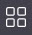
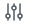

# Ricgraph with Neo4j graph database backend

Ricgraph can use two [graph database
backends](https://en.wikipedia.org/wiki/Graph_database):
[Neo4j](https://neo4j.com) and [Memgraph](https://memgraph.com). 
This page describes how to install Ricgraph with Neo4j graph
database backend.
Neo4j has several products:

* [Neo4j Community Edition](https://neo4j.com/download-center/#community), allows
  to explore the graph using
  [Cypher queries](https://en.wikipedia.org/wiki/Cypher_(query_language)) only.
* [Neo4j Desktop](https://neo4j.com/download-center/#desktop);
* (optional) [Neo4j Bloom graph visualization tool](https://neo4j.com/product/bloom),
  included with Neo4j Desktop
  (according to Neo4j:
  "A beautiful and expressive data visualization tool to quickly explore and freely interact with
  Neo4j’s graph data platform with no coding required");

To use Ricgraph, if you choose the Neo4j graph database backend (which is recommended for now),
you need to choose between Neo4j Community Edition and Neo4j Desktop.
On this page you can find:

* [Install and start Neo4j Community Edition](#install-and-start-neo4j-community-edition)
* [Install Neo4j Desktop](#install-neo4j-desktop)
* [Start Neo4j Desktop](#start-neo4j-desktop)
* [Dumping and restoring the Ricgraph database](#dumping-and-restoring-the-ricgraph-database)
  * [Create a Neo4j Desktop database dump of Ricgraph](#create-a-neo4j-desktop-database-dump-of-ricgraph)
  * [Create a Neo4j Community Edition database dump of Ricgraph](#create-a-neo4j-community-edition-database-dump-of-ricgraph)
  * [Restore a Neo4j Desktop database dump of Ricgraph in Neo4j Desktop](#restore-a-neo4j-desktop-database-dump-of-ricgraph-in-neo4j-desktop)
  * [Restore a Neo4j Desktop database dump of Ricgraph in Neo4j Community Edition](#restore-a-neo4j-desktop-database-dump-of-ricgraph-in-neo4j-community-edition)
  * [Restore a Neo4j Community Edition database dump of Ricgraph in Neo4j Community Edition](#restore-a-neo4j-community-edition-database-dump-of-ricgraph-in-neo4j-community-edition)
* [Install Bloom configuration for Neo4j Desktop (optional)](#install-bloom-configuration-for-neo4j-desktop-optional)
* [How to use Bloom for Neo4j Desktop (optional)](#how-to-use-bloom-for-neo4j-desktop-optional)
* [How to solve an AttributeError: Neo4jDriver object has no attribute executequery](#how-to-solve-an-attributeerror-neo4jdriver-object-has-no-attribute-executequery)

[Return to main README.md file](../README.md#ricgraph---research-in-context-graph).


## Install and start Neo4j Community Edition
To do this, you can either use the [Ricgraph Makefile](ricgraph_install_configure.md#ricgraph-makefile) 
and execute as user *root*
command `make install_enable_neo4j_community`, or follow the steps below.

* Login as user *root*.
* Install Neo4j Community Edition (it is free).
  To do this, go to the
  [Neo4j Deployment Center](https://neo4j.com/deployment-center).
  Go to section "Graph Database Self-Managed", choose "Community".
  Choose the latest version of Neo4j. Then choose your favorite package
  format:
    * OpenSUSE/Fedora: "Red Hat Linux Package (rpm)".
    * Debian/Ubuntu: "Debian/Ubuntu Package (deb)".

  Download the package and install it.
  You might get an error message about a failed dependency on *cypher-shell*,
  or on other dependencies.
    * OpenSUSE/Fedora: use either ``rpm -i <packagename>`` (first install)
      or ``rpm -U <packagename>`` (update).
    * Debian/Ubuntu: use ``apt install <packagename>``
    * If you get an error message about a failed dependency on *cypher-shell*, install
      *cypher-shell* separately as follows:
        * Go to the
          [Tools tab of the Neo4j Deployment Center](https://neo4j.com/deployment-center/#tools-tab).
          Go to section "Cypher Shell", choose the version of Cypher Shell that matches
          the version of the Neo4j Community Edition you have downloaded above.
          Then choose the version that fits your Linux version:
            * OpenSUSE: "Linux cypher-shell_X.YY.0-Z.noarch.rpm".
            * Debian/Ubuntu: "Linux cypher-shell_X.YY.0_all.deb".
        * Click "Download" and install it.
        * Install again Neo4j Community Edition (see above).
    * If you get an error message about failed other dependencies, install
      these other packages.

* You need to reset the default Neo4j password.
  This password is necessary in section
  [Create a Python virtual environment and install Ricgraph in
  it](ricgraph_as_server.md#create-a-python-virtual-environment-and-install-ricgraph-in-it).
  Run:
  ``` 
  /usr/bin/neo4j-admin dbms set-initial-password [the new password]
  ``` 
  Note that this command only works if you have not started Neo4j yet.
  Otherwise, follow the steps in the next section
  *Post-install steps Neo4j Community Edition*.

* If the installation has finished, make sure it runs by typing:
  ``` 
  systemctl enable neo4j.service
  systemctl start neo4j.service
  ```
  Check the log for any errors, use one of:
  ```
  systemctl -l status neo4j.service
  journalctl -u neo4j.service
  ```
* Exit from user *root*.

* Skip the next section *Post-install steps Neo4j Community Edition* (you have
  already reset the password above).

### Post-install steps Neo4j Community Edition
If you use the [Ricgraph Makefile](ricgraph_install_configure.md#ricgraph-makefile),
you do not need to do this. Otherwise, for your first run of Neo4j Community Edition 
only, you need to
change the default username and password of Neo4j:

* In your web browser, go to
  [http://localhost:7474/browser](http://localhost:7474/browser).
* Neo4j will ask you to login, use username *neo4j* and password *neo4j*.
* Neo4j will ask you to change your password. Change it.
  You will need this new password in section
  [Create a Python virtual environment and install Ricgraph in
  it](ricgraph_as_server.md#create-a-python-virtual-environment-and-install-ricgraph-in-it).


## Install Neo4j Desktop
To do this, you can either use the [Ricgraph Makefile](ricgraph_install_configure.md#ricgraph-makefile)
and execute
command `make install_neo4j_desktop`, or follow the steps below.

1. Install Neo4j Desktop Edition (it is free). 
   To do this, go to the 
   [Neo4j Deployment Center](https://neo4j.com/deployment-center). 
   Go to section "Neo4j Desktop". Choose the latest version of Neo4j Desktop.
   Download the Linux version. It is an [AppImage](https://en.wikipedia.org/wiki/AppImage),
   so it can be installed and used without root permissions. You will be asked to fill in a form before
   you can download. In the following screen you will be given a "Neo4j Desktop Activation Key". Save it.
1. The downloaded file is called something
   like *neo4j-desktop-X.Y.Z-x86_64.AppImage*, where *X.Y.Z* is a version number.
   Make it executable using "chmod 755 \[filename\]". 

### Post-install steps Neo4j Desktop

1. Start Neo4j Desktop by clicking on the downloaded file. 
1. Accept the license. 
1. Enter your activation key in the right part of the screen.
   Click "Activate".
   If you do not have a key, fill in the left part of the screen.
   Click "Register with Email".
   Wait awhile.
1. Choose whether you would like to participate in anonymous reporting.
1. You may be offered updates for Neo4j Desktop components, please update.
1. Move your mouse to "Example Project" in the left column.
   A red trash can icon appears. Click it to remove the Example
   Project database "Movie DBMS". Confirm. Then wait awhile.
1. The text "No projects found" will appear. Create a project by clicking the button "+ New Project".
1. The text "Project" appears with the text "Add a DBMS to get started". Click on the "+ Add" button
   next to it and select "Local DBMS". Leave the name as it is ("Graph DBMS") and fill in a password. 
   Click "Create".
1. [This step is not necessary if you use the [Ricgraph Makefile](ricgraph_install_configure.md#ricgraph-makefile)]
   Insert the password in field *graphdb_password* in
   the [Ricgraph initialization file](ricgraph_install_configure.md#ricgraph-initialization-file).
1. Exit Neo4j Desktop using the "File" menu and select "Quit". If your database was active
   a message similar to "Your DBMS [name] is running, are you sure you want to quit" appears,
   choose "Stop DBMS, then quit".
1. Ready.

Now we need to find the port number which Neo4j Desktop is using:

1. [Start Neo4j Desktop](#start-neo4j-desktop). Start the Graph DBMS.
1. Click on the words "Graph DBMS". At the right (or below, 
   depending on the width of the Neo4j Desktop window) a new screen appears.
   Look at the tab "Details". Note the port number next to "Bolt port" (the default
   value is 7687).
   Only if it is a different value, you will need to insert this port number in 
   field *graphdb_port* in
   the [Ricgraph initialization file](ricgraph_install_configure.md#ricgraph-initialization-file), see below.
1. Ready.


## Start Neo4j Desktop

1. Click on the downloaded AppImage. It will be called something
   like *neo4j-desktop-X.Y.Z-x86_64.AppImage*, where *X.Y.Z* is a version number.
1. At the top right there is a text "No active DBMS".
1. Move your mouse to the text "Graph DBMS". When you hoover it, a button
   will appear with the text "Start". Click it.
1. Wait until the Neo4j graph database engine has started.
   It may ask for a password that has
   been changed. Enter the password you have used
   while creating your database. Click "Save".
1. Now, next to the text "Graph DBMS" a green icon appears with
   the text "ACTIVE". Your graph database engine is active and ready for use.


## Dumping and restoring the Ricgraph database
Depending on your situation (whether you use Neo4j Desktop or
Neo4j Community Edition), this section lists the methods for
dumping and restoring the Ricgraph database:

* [Create a Neo4j Desktop database dump of Ricgraph](#create-a-neo4j-desktop-database-dump-of-ricgraph)
* [Create a Neo4j Community Edition database dump of Ricgraph](#create-a-neo4j-community-edition-database-dump-of-ricgraph)
* [Restore a Neo4j Desktop database dump of Ricgraph in Neo4j Desktop](#restore-a-neo4j-desktop-database-dump-of-ricgraph-in-neo4j-desktop)
* [Restore a Neo4j Desktop database dump of Ricgraph in Neo4j Community Edition](#restore-a-neo4j-desktop-database-dump-of-ricgraph-in-neo4j-community-edition)
* [Restore a Neo4j Community Edition database dump of Ricgraph in Neo4j Community Edition](#restore-a-neo4j-community-edition-database-dump-of-ricgraph-in-neo4j-community-edition)

### Create a Neo4j Desktop database dump of Ricgraph
To create a Neo4j Desktop database dump of Ricgraph, follow these steps:

1. Start Neo4j Desktop if it is not running, or
   stop the graph database if it is running.
1. Hoover over the name of your graph database (probably "Graph DBMS"),
   and click on the three horizontal dots at the right.
1. Select "Dump".
1. Your graph database will be dumped. This may take a while. When it
   is ready, a message appears.
1. Ready.

### Create a Neo4j Community Edition database dump of Ricgraph
To do this, you can either use the [Ricgraph Makefile](ricgraph_install_configure.md#ricgraph-makefile)
and execute
command `make dump_graphdb_neo4j_community`, or follow the steps below.

To create a Neo4j Community Edition database dump of Ricgraph, follow these steps:

1. Login as user *root*.
1. Stop Neo4j Community Edition:
   ```
   systemctl stop neo4j.service
   ```
1. To be able to restore a Neo4j database dump you need to set several permissions
   on */etc/neo4j*:
   ```
   chmod 640 /etc/neo4j/*
   chmod 750 /etc/neo4j
   ```
1. Do the database dump:
   ```
   neo4j-admin database dump --expand-commands system --to-path=[path to database dump directory]
   neo4j-admin database dump --expand-commands neo4j --to-path=[path to database dump directory]
   ```
1. Start Neo4j Community Edition:
   ```
   systemctl start neo4j.service
   ```
1. Check the log for any errors, use one of:
   ```
   systemctl -l status neo4j.service
   journalctl -u neo4j.service
   ```
1. Exit from user *root*.
 

### Restore a Neo4j Desktop database dump of Ricgraph in Neo4j Desktop
To restore a 
[Neo4j Desktop database dump of Ricgraph](#create-a-neo4j-desktop-database-dump-of-ricgraph) 
in Neo4j Desktop, follow these steps:

1. Start Neo4j Desktop if it is not running, or 
   stop the graph database if it is running.
1. Click on the button "Add" on the right side of "Project" and select "File".
1. Select the file "neo4j.dump" from a previous Neo4j Desktop database dump.
   This file will be added to the "File" section a little down the "Project" window.
1. Hoover over this file and click on the three horizontal dots at the right.
1. Select "Create new DBMS from dump".
1. Give it a name, e.g. "Graph DBMS from import file".
1. When asked, enter the password you have specified in 
   the [Ricgraph initialization file](ricgraph_install_configure.md#ricgraph-initialization-file)
   (this saves you from entering a new password in that file).
1. A new local graph database is being created. This may take a while.
1. Hoover over the newly created graph database and click "Start" to run it.
1. Optional: Once it is active, [install the Bloom 
   configuration](#install-bloom-configuration-for-neo4j-desktop-optional).
1. Now you are ready to explore the data 
   using [Ricgraph Explorer](ricgraph_explorer.md#ricgraph-explorer) or
   using [Bloom](#how-to-use-bloom-for-neo4j-desktop-optional).

### Restore a Neo4j Desktop database dump of Ricgraph in Neo4j Community Edition
To restore a
[Neo4j Desktop database dump of Ricgraph](#create-a-neo4j-desktop-database-dump-of-ricgraph)
in Neo4j Community Edition, follow these steps:

1. Login as user *root*.
1. Stop Neo4j Community Edition:
   ```
   systemctl stop neo4j.service
   ```
1. To be able to restore a Neo4j database dump you need to set several permissions
   on */etc/neo4j*:
   ```
   chmod 640 /etc/neo4j/*
   chmod 750 /etc/neo4j
   ```
1. Save the old database:
   ```
   cd /var/lib/neo4j
   mv data/ data-old
   ```
1. Go back to your working directory and restore the database dump:
   ```
   cd
   neo4j-admin database load --expand-commands neo4j --from-path=[path to database dump directory] --overwrite-destination=true
   ```
   For *path to database dump directory*, specify the path, not the path and the name of the
   database dump file (this name is *neo4j.dump*, it will be inferred automatically
   by the *neo4j-admin* command).
1. Set the correct permissions on */var/lib/neo4j/data*:
   ```
   cd /var/lib/neo4j
   chown -R neo4j:neo4j data
   ```
1. Start Neo4j Community Edition:
   ```
   systemctl start neo4j.service
   ```
1. Check the log for any errors, use one of:
   ```
   systemctl -l status neo4j.service
   journalctl -u neo4j.service
   ```
1. In your web browser, go to 
   [http://localhost:7474/browser](http://localhost:7474/browser).
1. Neo4j will ask you to login, use username *neo4j* and password *neo4j*.
1. Neo4j will ask you to change your password, 
   for the new password, enter the password you have specified in
   the [Ricgraph initialization file](ricgraph_install_configure.md#ricgraph-initialization-file)
   (this saves you from entering a new password in that file).
1. Restart Ricgraph Explorer if you use 
   [Ricgraph in a multi-user environment](ricgraph_as_server.md#ricgraph-as-a-server-on-linux):
   ```
   systemctl restart ricgraph_explorer_gunicorn.service
   ```
1. Check the log for any errors, use one of:
   ```
   systemctl -l status ricgraph_explorer_gunicorn.service
   journalctl -u ricgraph_explorer_gunicorn.service
   ```
1. Done. If all works well you might want to remove your old database:
   ```
   cd /var/lib/neo4j
   rm -r data-old
   ```
1. Exit from user *root*.


### Restore a Neo4j Community Edition database dump of Ricgraph in Neo4j Community Edition
To do this, you can either use the [Ricgraph Makefile](ricgraph_install_configure.md#ricgraph-makefile)
and execute
command `make restore_graphdb_neo4j_community`, or follow the steps below.

To restore a
[Neo4j Community Edition database dump of Ricgraph](#create-a-neo4j-community-edition-database-dump-of-ricgraph)
in Neo4j Community Edition, follow these steps:

1. Login as user *root*.
1. Stop Neo4j Community Edition:
   ```
   systemctl stop neo4j.service
   ```
1. To be able to restore a Neo4j database dump you need to set several permissions
   on */etc/neo4j*:
   ```
   chmod 640 /etc/neo4j/*
   chmod 750 /etc/neo4j
   ```
1. Save the old database:
   ```
   cd /var/lib
   mv neo4j/ neo4j-old
   mkdir /var/lib/neo4j
   ```
1. Go back to your working directory and restore the database dump:
   ```
   cd
   neo4j-admin database load --expand-commands system --from-path=[path to database dump directory] --overwrite-destination=true
   neo4j-admin database load --expand-commands neo4j --from-path=[path to database dump directory] --overwrite-destination=true
   ```
   For *path to database dump directory*, specify the path, not the path and the name of the
   database dump file, it will be inferred automatically
   by the *neo4j-admin* command.
1. Set the correct permissions on */var/lib/neo4j/data*:
   ```
   cd /var/lib
   chown -R neo4j:neo4j neo4j
   ```
1. Start Neo4j Community Edition:
   ```
   systemctl start neo4j.service
   ```
1. Check the log for any errors, use one of:
   ```
   systemctl -l status neo4j.service
   journalctl -u neo4j.service
   ```
1. Restart Ricgraph Explorer if you use
   [Ricgraph in a multi-user environment](ricgraph_as_server.md#ricgraph-as-a-server-on-linux):
   ```
   systemctl restart ricgraph_explorer_gunicorn.service
   ```
1. Check the log for any errors, use one of:
   ```
   systemctl -l status ricgraph_explorer_gunicorn.service
   journalctl -u ricgraph_explorer_gunicorn.service
   ```
1. Done. If all works well you might want to remove your old database:
   ```
   cd /var/lib
   rm -r neo4j-old
   ```
1. Exit from user *root*.


## Install Bloom configuration for Neo4j Desktop (optional)
This is only necessary if you plan to use Bloom. If you don't know, skip this step for now,
you can come back to it later.

[Bloom is Neo4j Desktop's graph visualization tool](https://neo4j.com/product/bloom).
It is included with Neo4j Desktop.
According to Neo4j it is:
"A beautiful and expressive data visualization tool to quickly explore and freely interact with
Neo4j’s graph data platform with no coding required".
Neo4j has
[extensive documentation how to use Bloom](https://neo4j.com/docs/bloom-user-guide/current)
and a
[Bloom overview](https://neo4j.com/docs/bloom-user-guide/2.6/bloom-visual-tour/bloom-overview).

1. [Start Neo4j Desktop](#start-neo4j-desktop).
1. Click on the icon 
   on the left side of Neo4j Desktop.
1. Click on "Neo4j Bloom". A new window appears.
1. In this window, click on the icon 
   at the top left. A Bloom "Perspective" slides out
   (Neo4j has an
   [extensive description how to
   use it](https://neo4j.com/docs/bloom-user-guide/current/bloom-visual-tour/perspective-drawer)).
1. Click on "neo4j > Untitled Perspective 1".
1. A new window appears.
   Right of the words "Untitled Perspective 1" there are three vertical dots. Click on it.
   Click on "Delete". The perspective "Untitled Perspective 1" is removed.
1. In the same window, right of the word "Perspectives" click on the word "Import".
   A file open window appears. Go to directory
   *neo4j_config* that is part of Ricgraph and
   select file *ricgraph_bloom_config.json*. Click "Open".
   The perspective "ricgraph_bloom_config" is loaded.
1. Click on the text "ricgraph_bloom_config".
1. Note that the text "neo4j > Untitled Perspective 1"
   has been changed in "neo4j > ricgraph_bloom_config".
1. A few centimeters below "neo4j > ricgraph_bloom_config", just below the text "Add category",
   click on the oval "RicgraphNode". At the right, a new window will appear.
1. In this window, below the word "Labels", check if an oval box with the text "RicgraphNode" is
   shown. If not, click on "Add labels", click on "RicgraphNode".
1. Click on the icon 
   to go back to the main screen of Bloom.
1. Click on the cog icon below , you might want
   to set "Use classic search" to "on".
1. Ready.


## How to use Bloom for Neo4j Desktop (optional)
If you have installed Bloom, below are some examples for a quick start.

### Open Bloom

1. [Start Neo4j Desktop](#start-neo4j-desktop).
1. Click on the icon
   
   on the left side of Neo4j Desktop.
1. Click on "Neo4j Bloom". A new window appears.

### Execute queries

The [Ricgraph Bloom configuration file](#install-bloom-configuration-for-neo4j-desktop-optional)
contains four different shortcuts for
[Cypher queries](https://en.wikipedia.org/wiki/Cypher_(query_language)):

* "Node name \[value of node to find\]": finds a node
  where property *name* of a node has value *\[value of node to find\]*.
* "Node category \[value of node to find\]": similar to
  "Node name ..." for property *category*.
* "Node value \[value of node to find\]": similar to
  "Node name ..." for property *value*.
* "Node comment \[value of node to find\]": similar to
  "Node name ..." for property *comment*.

These queries can be entered in the Bloom text box "Search graph",
by typing e.g. "Node name ORCID" or "Node category data set".
For more information see
[Bloom search bar](https://neo4j.com/docs/bloom-user-guide/2.6/bloom-visual-tour/search-bar)
and [Boom pattern
search](https://neo4j.com/docs/bloom-user-guide/current/bloom-tutorial/graph-pattern-search).

Nodes found can be examined or expanded as described in the section
[Actions while clicking on a node](#Actions-while-clicking-on-a-node).
The result will be visualized as described in section
[Visualization of nodes](#Visualization-of-nodes).

### Actions while clicking on a node

The following are some examples of actions while clicking on a node:

* Double left-click on a node: the properties of a node are shown in a window.
* Right-click right on a node, choose "Expand", choose "All": The node will be
  expanded with all nodes connected to it.
* Multiple nodes can be selected by selecting one node, holding the
  Control key and selecting other nodes.
* Right-click on a node, choose "Dismiss": This node will
  be removed from the visualization.
* Right-click on a node, choose "Dismiss other nodes": All other nodes will
  be removed from the visualization.
* For other actions, see
  [Bloom actions](https://neo4j.com/docs/bloom-user-guide/2.6/bloom-visual-tour/search-bar/#_actions).

### Visualization of nodes

Nodes can be visualized in different ways, by changing e.g. their
size or color. This can be changed as follows:

1. On the right side of the Bloom window, there is
   an icon . Click it
   (Neo4j has [extensive documentation how to use
   it](https://neo4j.com/docs/bloom-user-guide/current/bloom-visual-tour/perspective-drawer)).
1. A new window appears. It shows the default settings for the display
   of nodes. You can change the color, size, the property to
   show on the node, and the icon.
1. In the tab "Rule-based" you can add your own rules.

The [Ricgraph Bloom configuration file](#install-bloom-configuration-for-neo4j-desktop-optional)
contains a few rules based on the value of properties.
Rules which determine the color of a node:

* if property *category* = "person": color = blue.
* if property *category* = "data set": color = green.
* if property *category* = "journal article": color = yellow.
* if property *category* = "software": color = red.
* all other nodes: color = grey.

Rules which determine the size of a node:

* if property *url_main* contains "uu01": size of the node = small. This indicates
  which nodes have been harvested from
  the data repository [Yoda](https://search.datacite.org/repositories/delft.uu).
* if property *url_other* contains "research-software-directory": size of the node = large.
  This indicates which nodes have been harvested from
  the [Research Software Directory](https://research-software-directory.org).
* all other nodes: size = medium.


## How to solve an AttributeError: Neo4jDriver object has no attribute executequery
If, at some point while running Ricgraph scripts or Ricgraph Explorer in a
virtual environment, you get an error message like:
```
Traceback (most recent call last):
  File "ricgraph_explorer.py", line 2930, in <module>
    initialize_ricgraph_explorer()
  File "ricgraph_explorer.py", line 2867, in initialize_ricgraph_explorer
    name_all = rcg.read_all_values_of_property('name')
  File "/opt/ricgraph_venv/ricgraph/ricgraph.py", line 1140, in read_all_values_of_property
    result = _graph.execute_query(cypher_query,
AttributeError: 'Neo4jDriver' object has no attribute 'execute_query'
```
or, after typing ``pip install -r requirements.txt``, you get an error message:
  ```
  ERROR: Could not find a version that satisfies the requirement neo4j>=5.8
  ```
then this means that your version of the Python module *neo4j* is too old.
Note that this is related to the Python module *neo4j*, not to the graph database backend
Neo4j Desktop or Neo4j Community Edition.
You need at least version 5.8 of the Python module *neo4j*.
With an "old" version of Python (3.6 and earlier), an old version
of module *neo4j* will be used. The only way to solve this is using a new version of
Python while creating the Python virtual environment. You can do this by using the
following command:

* Create a Python virtual environment:
  in */opt*, type:
  ```
  python3.11 -m venv ricgraph_venv
  ```
in section
[Create a Python virtual environment and install Ricgraph in
it](ricgraph_as_server.md#create-a-python-virtual-environment-and-install-ricgraph-in-it). 
For *python3.11* you can take any Python version that is installed
on your computer, as long as it is at least Python 3.9.
