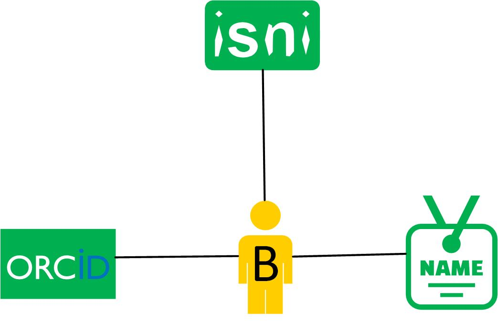
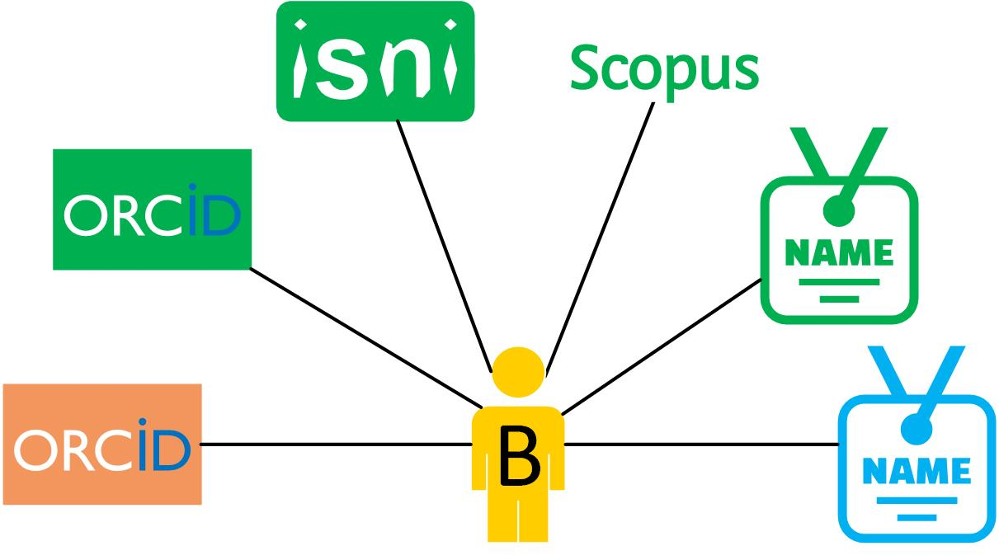

# Implementation details

On this page, you can find more information about:

* [Person identifiers](#person-identifiers).
* The [Person-root node in Ricgraph](#person-root-node-in-ricgraph).
* [Properties of nodes in Ricgraph](#properties-of-nodes-in-ricgraph).
* [Conventions for names of (sub-)organizations in Ricgraph](#conventions-for-names-of-sub-organizations-in-ricgraph).

You can also look at
[Example research questions](ricgraph_explorer.md#example-research-questions).

[Return to main README.md file](../README.md#ricgraph---research-in-context-graph).

## Person identifiers

In the research world, persons can have any number of different identifiers.
Some of these are standard, generally accepted and more-or-less unique identifiers
over the lifetime of a person. These are called
[persistent identifiers](https://en.wikipedia.org/wiki/Persistent_identifier).
Others are non-unique, some are specific to an organization and some are specific to a company.
Examples are:

* persistent identifiers: [ORCID](https://en.wikipedia.org/wiki/ORCID),
  [ISNI](https://en.wikipedia.org/wiki/International_Standard_Name_Identifier);
* non-unique identifiers: full name (there are persons with the same name);
* organization identifiers: employee ID, email address (will change when a person leaves
  an organization);
* company identifiers:
  [Scopus Author ID](https://www.scopus.com/freelookup/form/author.uri).

## Person-root node in Ricgraph

Ricgraph uses a special node *person-root*. This node is connected to all the different
person identifiers which have been harvested.
*Person-root* "represents" a person. Research outputs from a person
will also be connected to this *person-root* node.
The following figures shows two examples. *B* is the *person-root* node. 

|                             a person with a few identifiers                              |                              a person with a lot of identifiers                              |
|:----------------------------------------------------------------------------------------:|:--------------------------------------------------------------------------------------------:|
|  |  |

A person can have any number of identifiers.
The person in the left figure has one *ORCID*, one *ISNI* and one *FULL_NAME*.
The person in the right figure has a lot more identifiers, and some identifiers appear more than once.
E.g. this person has two different ORCIDs and two FULL_NAMEs (with different spellings).

## Properties of nodes in Ricgraph

All nodes in Ricgraph have the following properties:

* `name`: name of the node, e.g. ISNI, ORCID, DOI, FULL_NAME, SCOPUS_AUTHOR_ID, etc.;
* `category`: category of the node,
  e.g. person, person-root, book, journal article, data set, software, etc.;
* `value`: value of the node;
* `_key`: key value of the node, not to be modified by the user;
* `_source`: sorted list of sources a record has been
  harvested from, not to be modified by the user.
* `_history`: list of history events of the node, not to be modified by the user.

Additional properties for nodes can be added by changing an entry in the
[Ricgraph initialization file](ricgraph_install_configure.md#ricgraph-initialization-file).
In the default configuration, the following properties are included:

* `comment`: comment for a node;
* `year`: year of a research output;
* `url_main`: main URL for a node, pointing to e.g. the corresponding ISNI, ORCID or DOI
  record on the web;
* `url_other`: other URL for a node, pointing to e.g. the originating record in the source system;
* `source_event`: an event to be added to `_source`.
* `history_event`: an event to be added to `_history`.

## Conventions for names of (sub-)organizations in Ricgraph

In the case that Ricgraph contains research information from multiple organizations, 
it is useful to
adhere to (sub-)organization naming conventions.

* [Organization abbreviation](ricgraph_harvest_scripts.md#organization-abbreviation).
  * Find the organization in the [Research Organization Registry (ROR)](https://ror.org).
    This will result in an organization name in a certain language. Create an abbreviation
    from this name, while respecting the language. 
  * Examples:
  
    | ROR organization name          | organization abbreviation |
    |--------------------------------|---------------------------|
    | Delft University of Technology | DUT                       |
    | Utrecht University             | UU                        | 
    | Vrije Universiteit Amsterdam   | VUA                       | 
* Organization name in Ricgraph.
  * Combine the organization abbreviation and the ROR organization name.
  * Examples:

    | Ricgraph organization name         |
    |------------------------------------|
    | DUT Delft University of Technology | 
    | UU Utrecht University              |
    | VUA Vrije Universiteit Amsterdam   |
* Faculty name in Ricgraph.
  * Combine the organization abbreviation, the word "Faculty", a colon (:), 
    and the English name
    for the faculty as used by the organization (as it is used in Pure).
  * Examples:

    | Ricgraph name                                |
    |----------------------------------------------|
    | DUT Faculty: Civil Engineering & Geosciences |
    | UU Faculty: Geosciences                      |
    | VUA Faculty: Faculty of Science              |
* Department, Subdepartement, Chair/Subunit, or other sub-organization name in Ricgraph.
  * Combine the organization abbreviation, the word for the 
    sub-organization, a colon (:), and the English name
    for the sub-organization as used by the organization (as it is used in Pure).
  * Examples:

    | Ricgraph name                                  |
    |------------------------------------------------|
    | DUT Department: Biomechanical Engineering      |
    | DUT Research Group: Physical and Space Geodesy |
    | UU Department: Dep Psychologie                 |
    | UU Chair/Subunit: LS Taal en cultuurstudies    |
    | VUA Department: Earth Sciences                 |
    | VUA Subdepartment: Chemistry and Biology       |
    | VUA Research Institute: Amsterdam Neuroscience |
* Hierarchy name in Ricgraph. This is a kind of meta category.
  * Combine the organization abbreviation, the word "Hierarchy", a colon (:),
    and the English name
    for the hierarchy as used by the organization (as it is used in Pure).
  * Examples:

    | Ricgraph name                              |
    |--------------------------------------------|
    | UU Hierarchy: Faculties                    |
    | UU Hierarchy: University Corporate Offices |
    | VUA Hierarchy: Faculties                   |
    | VUA Hierarchy: Research Institutes         |
* Services (support) organization name in Ricgraph.
  * Combine the organization abbreviation, the word "Services", a colon (:),
    and the English name
    for the sub-organization as used by the organization (as it is used in Pure).
  * Examples:

    | Ricgraph name                                  |
    |------------------------------------------------|
    | UU Services: Information & Technology Services |
    | UU Services: University Library                |
    | VUA Services: University Library               |
