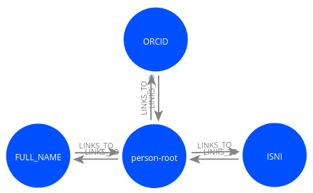
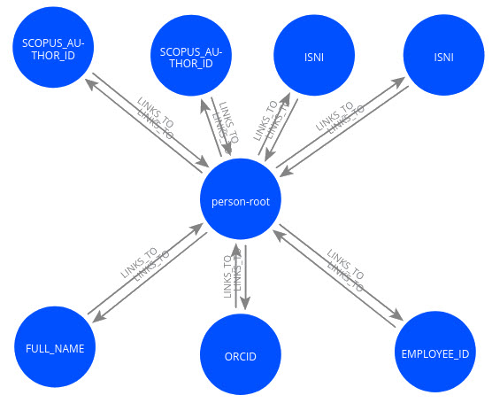
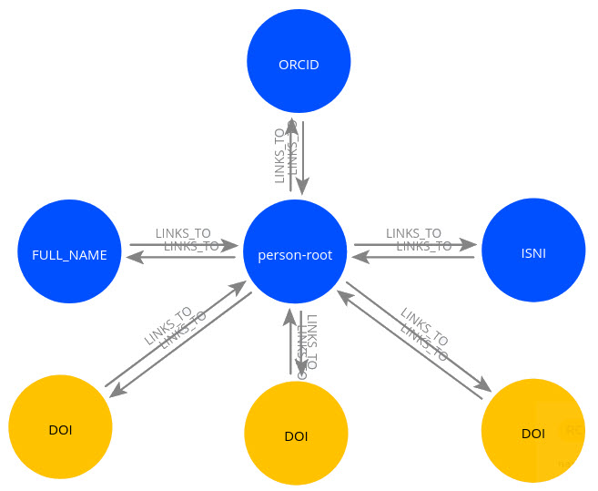
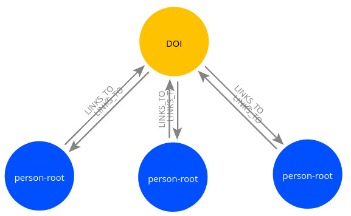

## Implementation details

[Return to main README.md file](../README.md).

### Person identifiers

In the research world, persons can have any number of different identifiers.
Some of these are standard, generally accepted and more-or-less unique identifiers
over the lifetime of a person. These are called
[persistent identifiers](https://en.wikipedia.org/wiki/Persistent_identifier).
Others are non-unique, some are specific to an organization and some are specific to a company.
Examples are:

* persistent identifiers: [ORCID](https://en.wikipedia.org/wiki/ORCID),
  [ISNI](https://en.wikipedia.org/wiki/International_Standard_Name_Identifier);
* non-unique identifiers: full name (there are persons with the same name);
* organization identifiers: employee ID, email address (will change when a person leaves
  an organization);
* company identifiers:
  [Scopus Author ID](https://www.scopus.com/freelookup/form/author.uri).

### Person-root node in Ricgraph

Ricgraph uses a special node *person-root*. This node is connected to all the different
person identifiers which have been harvested.
*Person-root* "represents" a person. Research outputs from a person
will also be connected to this *person-root* node.
The following figure shows two examples (click the figure to enlarge).

| a person with a few identifiers               | a person with a lot of identifiers            |
|-----------------------------------------------|-----------------------------------------------|
|  |  |

A person can have any number of identifiers.
The person in the left figure has one *ORCID*, one *ISNI* and one *FULL_NAME*.
The person in the right figure has a lot more identifiers, and some identifiers appear more than once.
E.g. this person has 2 SCOPUS_AUTHOR_IDs and 2 ISNIs.

### Research outputs connected to persons

| one person with three research outputs          | three persons with one research output          |
|-------------------------------------------------|-------------------------------------------------|
|  |  |

In both figures, nodes in blue are related to a person and nodes in yellow to journal articles.
The person in the left figure is identified by *FULL_NAME*, *ISNI* and *ORCID*,
which are connected to the *person-root* node (as in the previous section). This person
has three journal articles, identified by *DOI*. These are also connected to the *person-root* node.
In the right figure, there are three *person-root* nodes, representing three different persons
(other nodes with person identifiers are not shown for readability).
All these persons have contributed to the same research output, identified by *DOI*.

### Return to main README.md file

[Return to main README.md file](../README.md).
