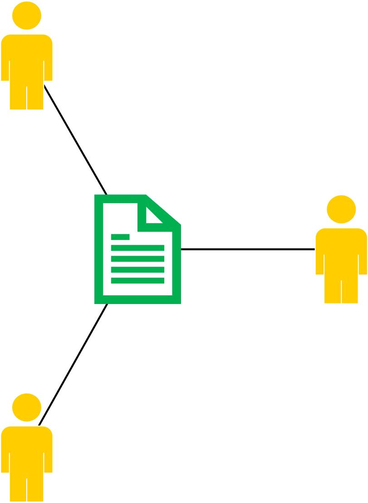

# Implementation details

On this page, you can find more information about:

* [Person identifiers](#person-identifiers).
* The [Person-root node in Ricgraph](#person-root-node-in-ricgraph).
* [Research outputs connected to persons](#research-outputs-connected-to-persons).
* [Example research questions](#example-research-questions).
* [Videos of Ricgraph](#videos-of-ricgraph).
* [Properties of nodes in Ricgraph](#properties-of-nodes-in-ricgraph).

[Return to main README.md file](../README.md#ricgraph---research-in-context-graph).

## Person identifiers

In the research world, persons can have any number of different identifiers.
Some of these are standard, generally accepted and more-or-less unique identifiers
over the lifetime of a person. These are called
[persistent identifiers](https://en.wikipedia.org/wiki/Persistent_identifier).
Others are non-unique, some are specific to an organization and some are specific to a company.
Examples are:

* persistent identifiers: [ORCID](https://en.wikipedia.org/wiki/ORCID),
  [ISNI](https://en.wikipedia.org/wiki/International_Standard_Name_Identifier);
* non-unique identifiers: full name (there are persons with the same name);
* organization identifiers: employee ID, email address (will change when a person leaves
  an organization);
* company identifiers:
  [Scopus Author ID](https://www.scopus.com/freelookup/form/author.uri).

## Person-root node in Ricgraph

Ricgraph uses a special node *person-root*. This node is connected to all the different
person identifiers which have been harvested.
*Person-root* "represents" a person. Research outputs from a person
will also be connected to this *person-root* node.
The following figures shows two examples. *B* is the *person-root* node. 

|                             a person with a few identifiers                              |                              a person with a lot of identifiers                              |
|:----------------------------------------------------------------------------------------:|:--------------------------------------------------------------------------------------------:|
|  |  |

A person can have any number of identifiers.
The person in the left figure has one *ORCID*, one *ISNI* and one *FULL_NAME*.
The person in the right figure has a lot more identifiers, and some identifiers appear more than once.
E.g. this person has two different ORCIDs and two FULL_NAMEs (with different spellings).

## Research outputs connected to persons

|                                  one person with three research outputs                                  |                                       three persons with one research output                                       |                          symbols for type of object                          |                              colors for source system                              |
|:--------------------------------------------------------------------------------------------------------:|:------------------------------------------------------------------------------------------------------------------:|:----------------------------------------------------------------------------:|:----------------------------------------------------------------------------------:|
|  |  |  |  |

The left figure shows how one person, its identifiers and research outputs are connected.
The right figure shows how three persons have contributed to one research output.

## Example research questions
The figure belows shows examples of research questions that can be answered using Ricgraph.
Click the figure to enlarge.

## Videos of Ricgraph
To see a demonstration of Ricgraph, you can look at 
the [videos we have made to demonstrate Ricgraph](ricgraph_example_use_videos.md#ricgraph-videos).

## Properties of nodes in Ricgraph

All nodes in Ricgraph have the following properties:

* `name`: name of the node, e.g. ISNI, ORCID, DOI, FULL_NAME, SCOPUS_AUTHOR_ID, etc.;
* `category`: category of the node,
  e.g. person, person-root, book, journal article, data set, software, etc.;
* `value`: value of the node;
* `_key`: key value of the node, not to be modified by the user;
* `_source`: sorted list of sources a record has been
  harvested from, not to be modified by the user.
* `_history`: list of history events of the node, not to be modified by the user.

Additional properties for nodes can be added by changing an entry in the
[Ricgraph initialization file](ricgraph_install_configure.md#ricgraph-initialization-file).
In the default configuration, the following properties are included:

* `comment`: comment for a node;
* `year`: year of a research output;
* `url_main`: main URL for a node, pointing to e.g. the corresponding ISNI, ORCID or DOI
  record on the web;
* `url_other`: other URL for a node, pointing to e.g. the originating record in the source system;
* `source_event`: an event to be added to `_source`.
* `history_event`: an event to be added to `_history`.
