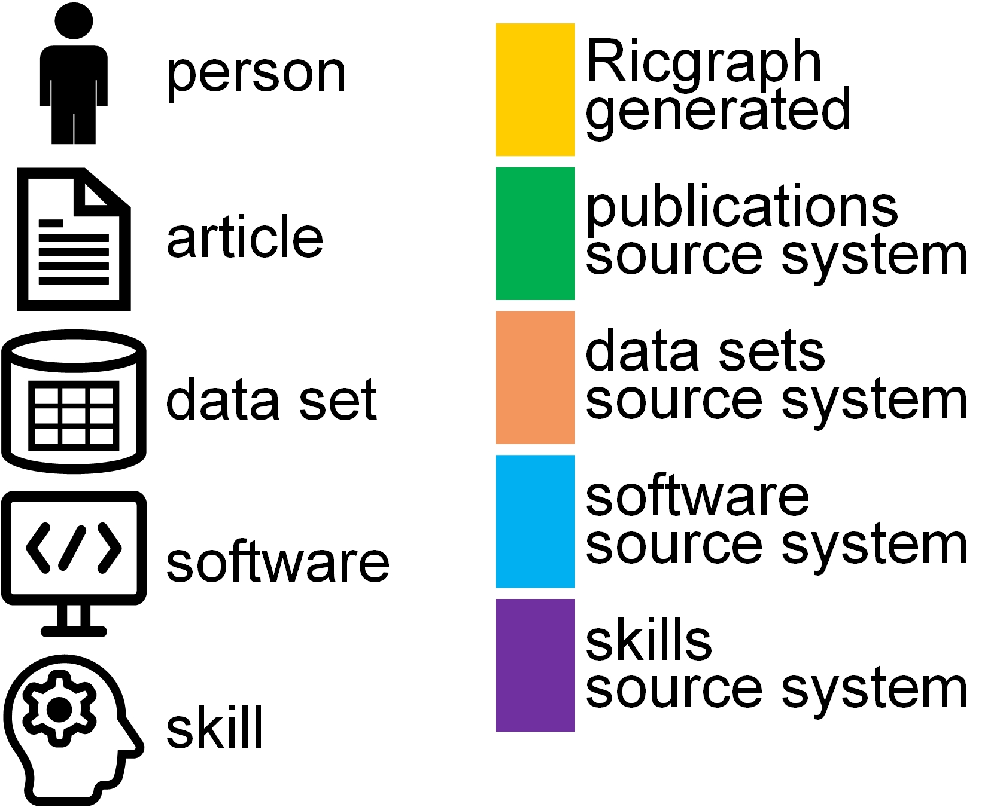
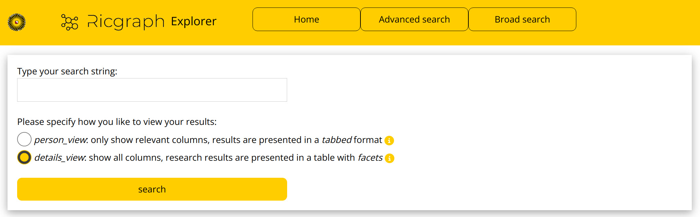
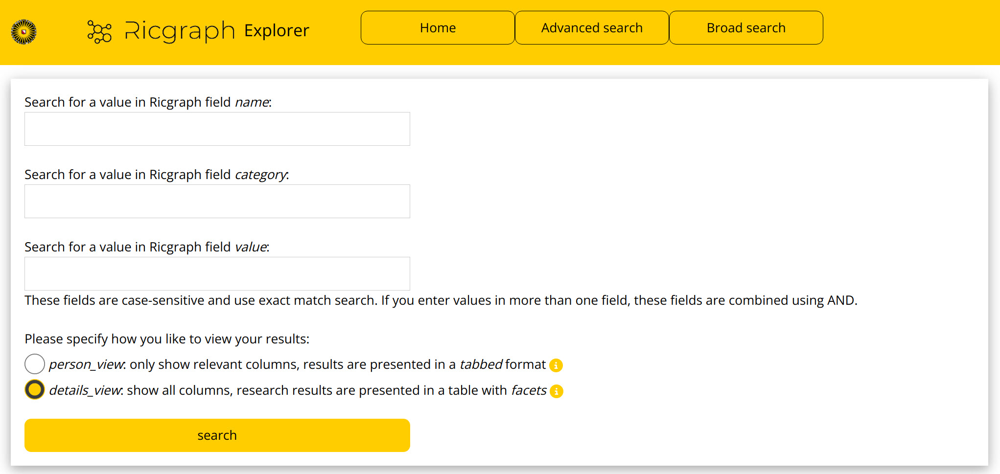
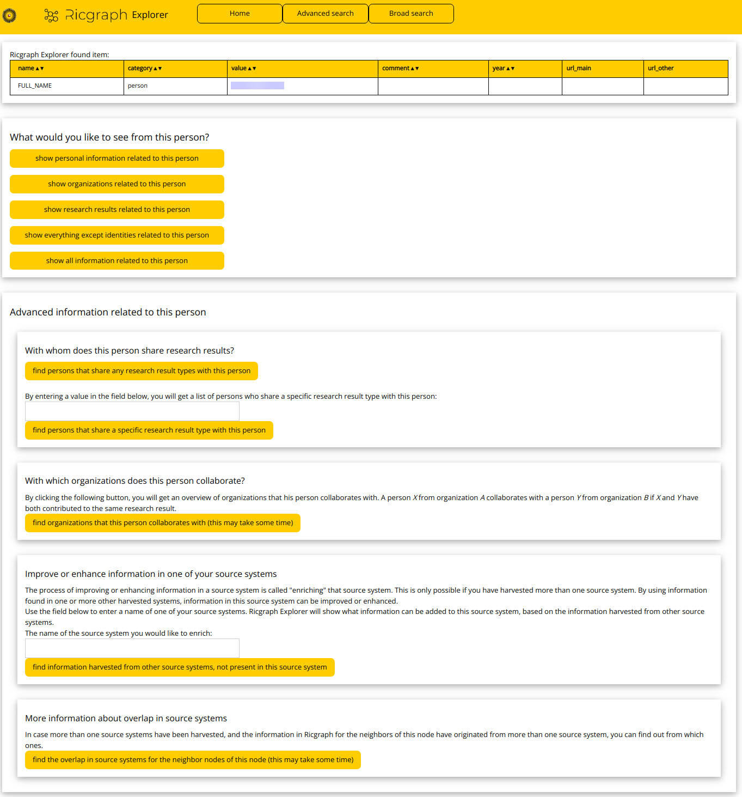
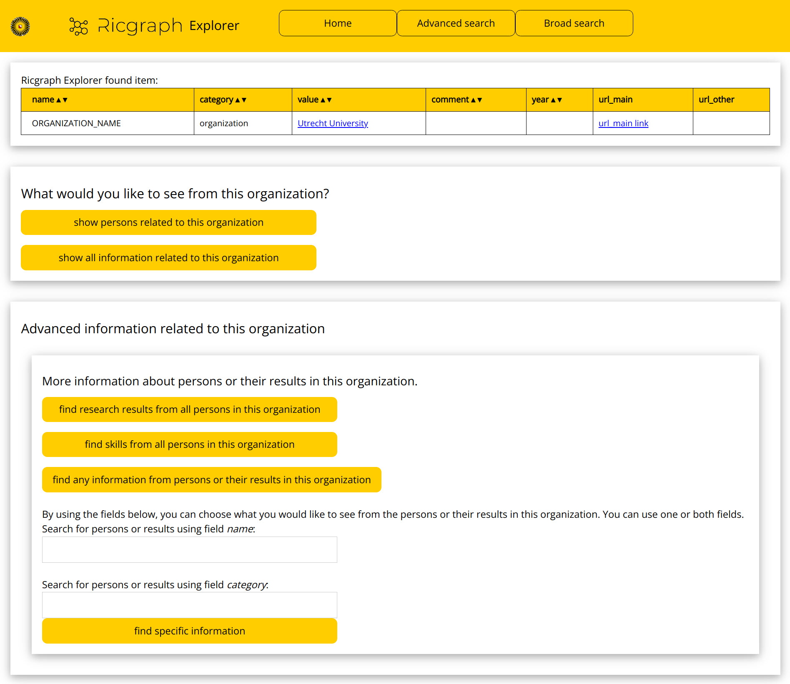
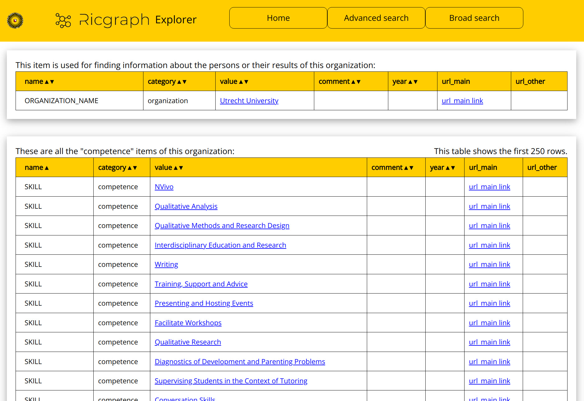

# Ricgraph Explorer

Ricgraph provides an exploration tool, so users do 
not need to learn a graph query language. This tool is called
_Ricgraph Explorer_. 
As it is a Python Flask application, it can be customized as needed. 
New queries (buttons) can be added, 
or the user interface can
be modified to fit a certain use case, user group, or application area.
The code can be found in
directory [ricgraph_explorer](../ricgraph_explorer).

In this documentation and on this page, we use the application area _research information_.
Ricgraph Explorer 
has several pre-build queries tailored to this application area,
each with its own button, for example:
* find a person, a (sub-)organization, a skill;
* when a person has been found, find its identities, skills, research results.

Ricgraph Explorer offers
[faceted navigation](https://en.wikipedia.org/wiki/Faceted_search).
That means, if a query results in a table with e.g. *journal articles*, *data sets*,
and *software*, you can narrow down on one or more of these categories by
checking or unchecking their corresponding checkbox.
An alternative view 
uses [tabbed navigation](https://en.wikipedia.org/wiki/Tab_(interface)).

This page describes what you can do with Ricgraph Explorer. It does this
by showing the flow through the web application by listing the buttons available. 
The text below lists
these buttons. For some of these buttons, a more extensive description is given.
After clicking a few buttons, and entering values in the fields
provided, the user will get a Results page. Since there are many possible result
pages, we only show one result page as example.

On this page, you can learn more about:
* [Working with Ricgraph Explorer](#working-with-ricgraph-explorer).
* Read about [how to start Ricgraph Explorer](#how-to-start-ricgraph-explorer).
* The [Home page](#home-page) of Ricgraph Explorer.
* The [Search page](#search-page) of Ricgraph Explorer.
* The [Person options page](#person-options-page) of Ricgraph Explorer.
* The [Organization options page](#organization-options-page) of Ricgraph Explorer.
* The [Results page](#results-page) of Ricgraph Explorer.
* Read about [browsing Ricgraph](#browsing-ricgraph).
* Learn how to [show a privacy statement or privacy measures 
  document](#showing-a-privacy-statement-or-privacy-measures-document).
 
[Return to main README.md file](../README.md).

## Working with Ricgraph Explorer

| screenshots of a usage flow through Ricgraph Explorer                                 | example research questions                                                                                                 |
|---------------------------------------------------------------------------------------|----------------------------------------------------------------------------------------------------------------------------|
|  |  |

You can click each figure to enlarge.
Some field values have been blurred for privacy reasons.

### Research question “What are the research results of person A” 
The left
figure above shows screenshots of web pages of Ricgraph Explorer for 
answering the research question “What are the research results of
person A” in figure (a) at the right.

The screenshot at the top left is the [home page](#home-page). 
After clicking “search for a person”,
Ricgraph Explorer shows a [search page](#search-page) (top right). 
A user types a name, and the 
[person options page](#person-options-page) is shown (bottom
left). After clicking “show research results related to this person”, the 
[results page](#results-page) is shown (bottom right). In that
page, the rows in the second table are (in this case) the journal article neighbors of 
the item in the first table (the
person the user searched). This person also has other types of research results: 
book chapters, data sets, other
contributions, books, reviews, and software (cf. row with orange rectangle, this is an
example of the tabbed navigation). The “comment” column contains the titles of
the journal articles. By clicking on an entry in the “value” column, in this case a 
DOI value, the user will go to this
neighbor. Ricgraph Explorer will show a page with persons who have contributed to 
that journal article. 

### Other research questions
In the left figure above,
after a click on a value in the “value” column in the bottom right result
page, the user will get the persons who have contributed to that research 
result, as in figure (b) at the right. Clicking “find
persons that share any result types with this person” in the bottom left 
person option page corresponds to figure (c),
and clicking “show personal information related to this person” corresponds to figure (e).

## How to start Ricgraph Explorer
Depending on how Ricgraph has been installed, there are various ways to start it.
* If you have installed Ricgraph yourself, using your own user id,
  you might need to start your graph database backend first:
  * If you use Neo4j Community Edition: very likely this is already running.
  * If you use Neo4j Desktop: read [Start Neo4j Desktop](ricgraph_backend_neo4j.md#start-neo4j-desktop).
  * If you use Memgraph: read [Install and start 
    Memgraph](ricgraph_backend_memgraph.md#install-and-start-memgraph).
* Start Ricgraph Explorer:
  * Use the [Ricgraph Makefile](ricgraph_install_configure.md#ricgraph-makefile) and execute
    command 
    ```
    make run_ricgraph_explorer
    ```
  * Run the *ricgraph_explorer.py* script in directory [ricgraph_explorer](../ricgraph_explorer).
     It will tell you which weblink and port to use, probably
     http://127.0.0.1:3030. Open a web browser and go to that link.
* If you use Ricgraph on a demo server, and you have used your own user id to log on to that server,
  you very probably do not need to start the graph database backend.
  * Open a web browser and go to http://127.0.0.1:3030.
* If you have a domain name to access Ricgraph, for example _www.ricgraph-example.com_:
  * Open a web browser and go to https://www.ricgraph-example.com.

## Home page
The figure below shows part of the home page.
Click on it to enlarge.


The home page lets the user choose between various methods to explore Ricgraph:
* Button _search for a person_.
  * in the [search page](#search-page) that is shown after you have clicked this button, 
    to search, type a full name or substring of a name.
  * if there is more than one result, select one person.
  * this person is shown on the [person options page](#person-options-page)
    for further exploration.
* Button _search for a (sub-)organization_. 
  * in the [search page](#search-page) that is shown after you have clicked this button, 
    to search, type a full organization name or substring of an organization name.
  * if there is more than one result, select one organization.
  * this organization is shown on the [organization options page](#organization-options-page)
    for further exploration.
* Button _search for a skill, expertise area or research area_
  [only available if you have nodes of category _competence_ in Ricgraph]:
  * in the [search page](#search-page) that is shown after you have clicked this button, 
    to search, type a skill, expertise area or research area, or
    substring of one of these.
  * if there is more than one result, select one.
  * the results are shown on the [results page](#results-page).
* Button _search for anything (broad search)_ or
  button _advanced search_.
  * in the [search page](#search-page) that is shown after you have clicked this button, 
    type something to search, the advanced search is a 
    case-sensitive exact match search 
    on one or more of the Ricgraph fields _name_, _category_, or _value_.
  * if there is more than one result, select one.
  * depending on the type of result:
    * if the result is a person, 
      the result is shown on the [person options page](#person-options-page)
      for further exploration.
    * if the result is an organization, 
      the result is shown on the [organization options page](#organization-options-page)
      for further exploration.
    * for all other results,
      the results are shown on the [results page](#results-page).

In the yellow top bar, there are more buttons:
* Button _Home_. This button returns the user to the [home page](#home-page).
* Button _Advanced search_. This leads to the advanced search page, see section
  [search page](#search-page).
* Button _Broad search_. This leads to the broad search page, see section
  [search page](#search-page).
* Button _REST API doc_. This leads to the documentation and try out page of
  the [Ricgraph REST API](ricgraph_restapi.md).

## Search page
There are two search pages:
* A broad search page, having one input field.
  This search is a case-insensitive search.
* An advanced search page, having three input fields.
  This search is a case-sensitive exact match search
  on one or more of the Ricgraph fields _name_, _category_, or _value_.
  
The figure below shows these search pages. Click on any figure to enlarge.

| broad search page                                                      | advanced search page                                                      |
|------------------------------------------------------------------------|---------------------------------------------------------------------------|
|  |  |


There are two methods for viewing the results:
* _person_view_: only show relevant columns, results are presented in 
  a [tabbed format](https://en.wikipedia.org/wiki/Tab_(interface)).
  Tables have fewer columns to reduce information overload.
* _details_view_: show all columns, research results are presented in 
  a [table with facets](https://en.wikipedia.org/wiki/Faceted_search).
  This view shows all columns .

## Person options page
You only get on this page if the result of your search is a person.
The figure below shows the person options page. Click on it to enlarge.



You can use one of these exploration options:
* Button _show personal information related to this person_.
* Button _show organizations related to this person_.
* Button _show research results related to this person_.
* Button _show everything except identities related to this person_.
* Button _show all information related to this person_.
* Button _find persons that share any research result types with this person_.
* Button _find persons that share a specific research result type with this person_.
  
  You will need to enter a research result type from a drop-down list.
* Button _find organizations that this person collaborates with_.
  
  This button gives an overview of organizations that this person collaborates with. 
  A person _X_ from organization _A_ collaborates with a person _Y_ from 
  organization _B_ if _X_ and _Y_ have both contributed to the same research result.
* Button _find information harvested from other source systems,
  not present in this source system_.

  You will need to enter a source system from a drop-down list.
  Next, this button gives an overview
  of information that can be added to the source system entered, based on the information
  harvested from other source systems.
  The process of improving or enhancing information in a source system is called "enriching" 
  that source system. This is only possible if you have harvested more than one source 
  system. 
* Button _find the overlap in source systems for the neighbor nodes of this node_.
  
  In case more than one source systems have been harvested, and the information 
  in Ricgraph for the neighbors of this node have originated from more than 
  one source system, clicking this button will show you from which ones.
    
For each of these buttons, the results are shown on the [results page](#results-page).

## Organization options page
You only get on this page if the result of your search is an organization.
The figure below shows the organization options page. Click on it to enlarge.



You can use one of these buttons:
* Button _show persons related to this organization_.
* Button _show all information related to this organization_.
* Button _find research results from all persons in this organization_.
* Button _find skills from all persons in this organization_.
* Button _find any information from persons or their results in this organization_.
* Button _find specific information_.

  You will need to enter a value for Ricgraph fields _name_ or _category_
  from a drop-down list.
  Next, this button gives an overview of the persons or their results in 
  this organization.

For all of these buttons the results are shown on the [results page](#results-page).

## Results page
The results page will look different depending on what results are shown.
The figure below shows an example of a part of the skills in an organization.
Click on it to enlarge.



## Browsing Ricgraph
You can browse the graph that Ricgraph has obtained by harvesting source systems
by clicking on a value in the _value_ column. 
In the figure in section [Results page](#results-page), 
the search was started with organization _Utrecht University_
(in the first table). 
The _SKILL_ neighbors of _Utrecht University_ are listed in the second table.
By clicking on e.g. _NVivo_, you will traverse to the _NVivo_ node,
and you will see the neighbors of this node. This can be repeated as desired.
It is also possible to start a new search using the buttons _Home_, _Advanced search_,
or _Broad search_ in the yellow title bar.

## Showing a privacy statement or privacy measures document
Ricgraph Explorer offers the possibility to show
a privacy statement or privacy measures document (or both) if desired for 
your Ricgraph production environment.
Placeholders have been provided in the files
[privacy_statement_placeholder.pdf](../ricgraph_explorer/static/privacy_statement_placeholder.pdf)
and
[privacy_measures_placeholder.pdf](../ricgraph_explorer/static/privacy_measures_placeholder.pdf).

How to use a privacy statement in Ricgraph Explorer?
* Create a privacy statement that fits your situation.
* Use the filename `privacy_statement.[extension of your text editor]`.
* Convert this file to a pdf file and use filename `privacy_statement.pdf`.
* Put it in `…/ricgraph_explorer/static`.
* In Ricgraph Explorer, in the footer you will find a link to this file.

How to use a privacy measures document in Ricgraph Explorer?
* Create a privacy measures document that fits your situation.
* Use the filename `privacy_measures.[extension of your text editor]`.
* Convert this file to a pdf file and use filename `privacy_measures.pdf`.
* Put it in `…/ricgraph_explorer/static`.
* In Ricgraph Explorer, in the footer you will find a link to this file.


