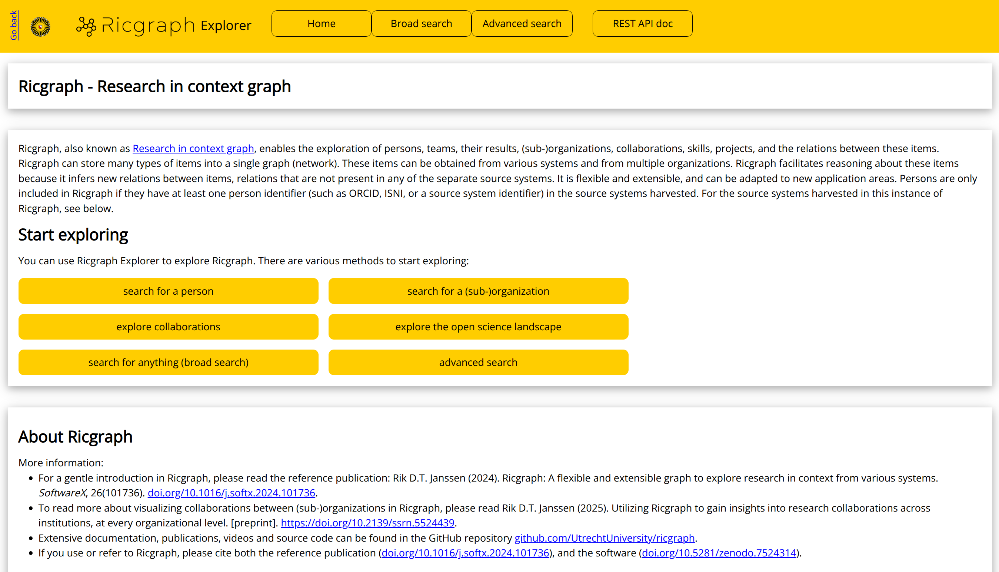
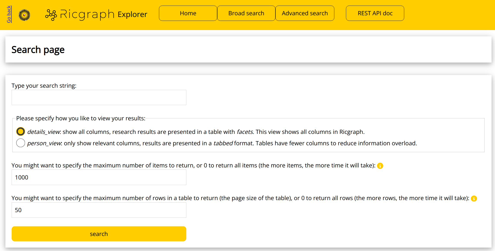
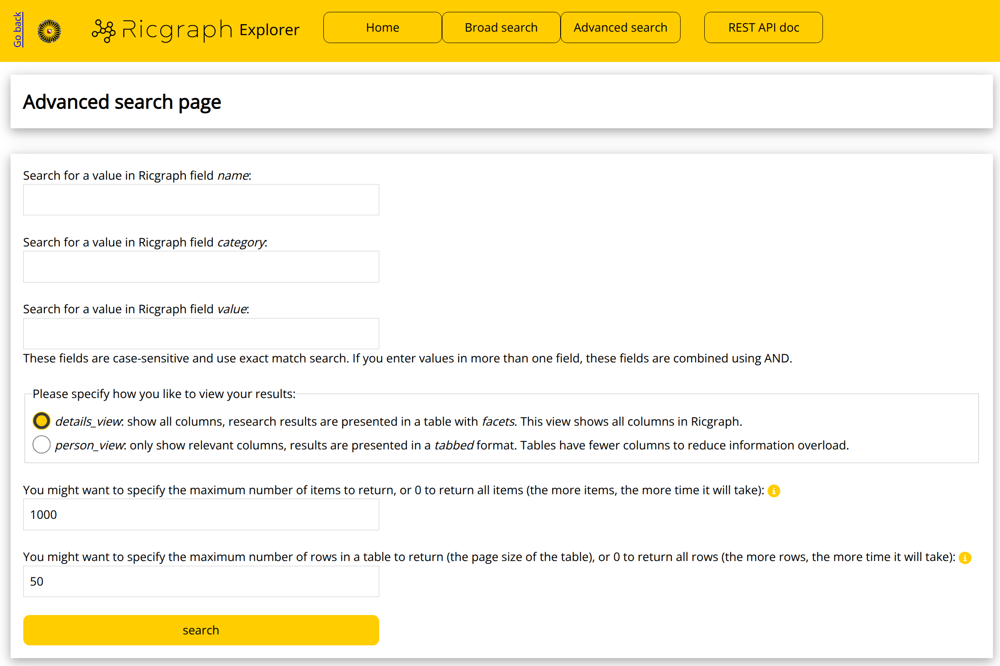
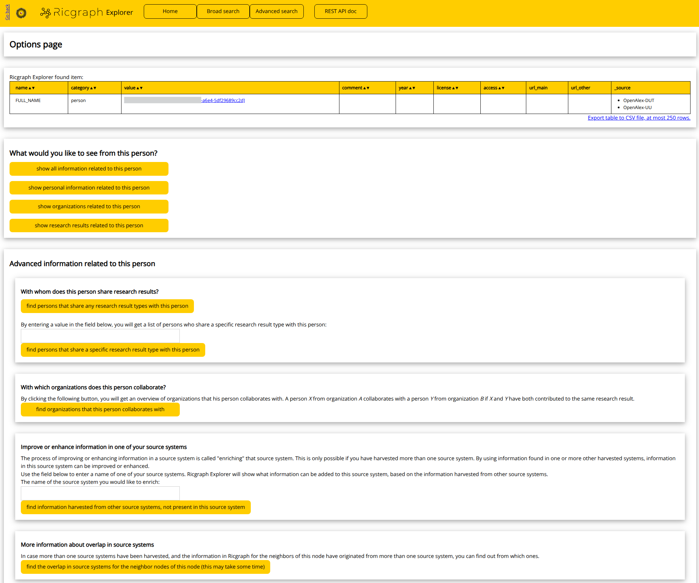
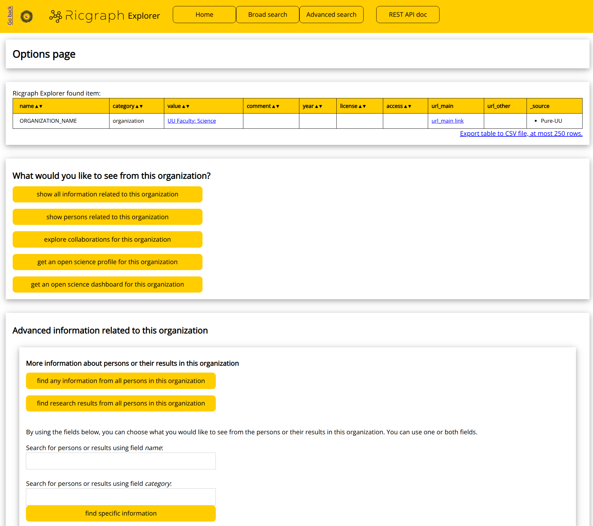
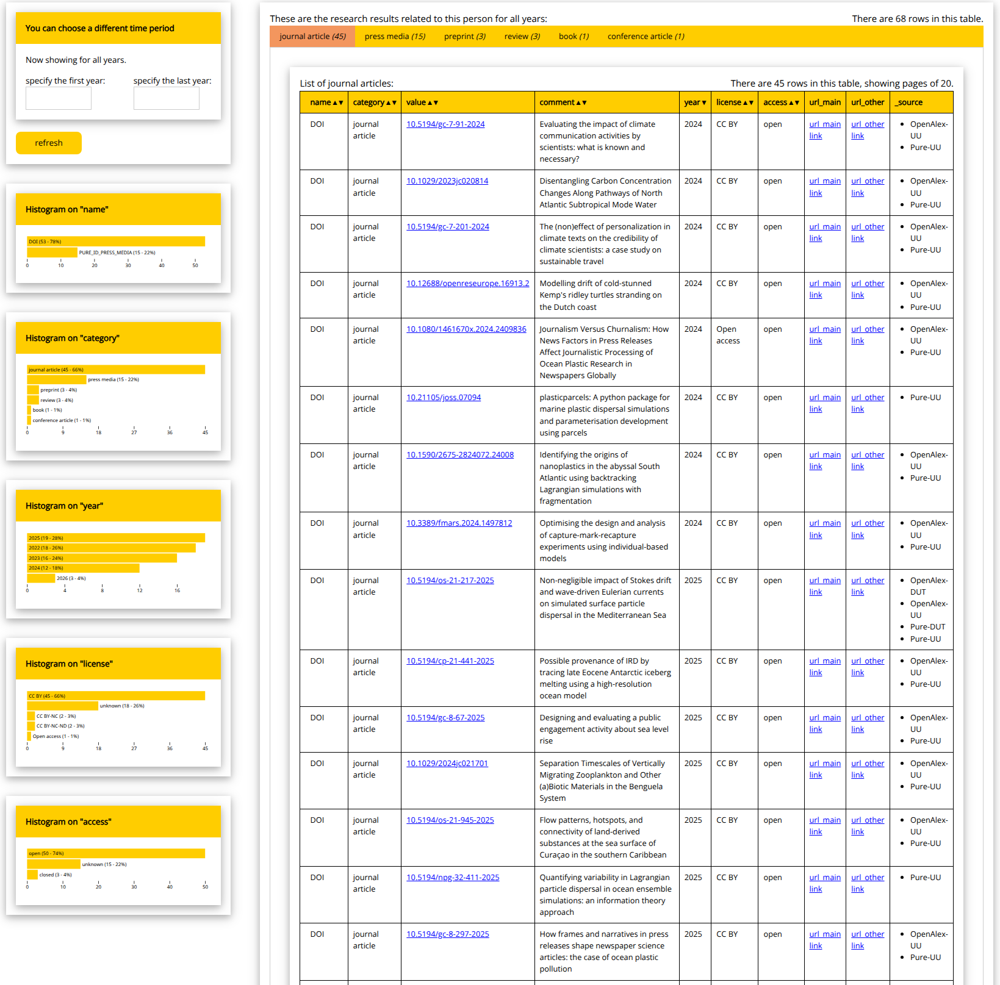

# Ricgraph Explorer

Ricgraph provides an exploration tool, so users do 
not need to learn a graph query language. This tool is called
_Ricgraph Explorer_. 
As it is a Python Flask application, it can be customized as needed. 
New queries (buttons) can be added, 
or the user interface can
be modified to fit a certain use case, user group, or application area.
The code can be found in
directory *ricgraph_explorer*.

In this documentation and on this page, we use the application area _research information_.
Ricgraph Explorer 
has several pre-build queries tailored to this application area,
each with its own button, for example:

* find a person, a (sub-)organization, explore collaborations, etc.
* when a person has been found, find its identities, skills, research results.

Ricgraph Explorer offers
[faceted navigation](https://en.wikipedia.org/wiki/Faceted_search).
That means, if a query results in a table with e.g. *journal articles*, *data sets*,
and *software*, you can narrow down on one or more of these categories by
checking or unchecking their corresponding checkbox.
An alternative view 
uses [tabbed navigation](https://en.wikipedia.org/wiki/Tab_(interface)).

This page describes what you can do with Ricgraph Explorer. It does this
by showing the flow through the web application by listing the buttons available. 
The text below lists
these buttons. For some of these buttons, a more extensive description is given.
After clicking a few buttons, and entering values in the fields
provided, the user will get a Results page. Since there are many possible result
pages, we only show one result page as example.

On this page, you can learn more about:

* Read about [how to start Ricgraph Explorer](#how-to-start-ricgraph-explorer).
* [Working with Ricgraph Explorer](#working-with-ricgraph-explorer).
* The [Home page](#home-page) of Ricgraph Explorer.
* The [Search page](#search-page) of Ricgraph Explorer.
* The [Person options page](#person-options-page) of Ricgraph Explorer.
* The [Organization options page](#organization-options-page) of Ricgraph Explorer.
* The [Results page](#results-page) of Ricgraph Explorer.
* Read about [browsing Ricgraph](#browsing-ricgraph).
* [Video Ricgraph Explorer](#video-ricgraph-explorer)
 

## How to start Ricgraph Explorer
Depending on how Ricgraph has been installed, there are various ways to start 
Ricgraph Explorer.

* You can use the Open Ricgraph demo server. This is the easiest method. 
  Consult the web page
  [Pilot project Open Ricgraph demo 
  server](https://www.ricgraph.eu/pilot-project-open-ricgraph-demo-server.html) 
  to find out what its link is.
* If you have installed Ricgraph for a single user,
  you might need to start your graph database backend first:
  * If you use Neo4j Community Edition: this will be already running.
  * If you use Neo4j Desktop: read [Start Neo4j Desktop](ricgraph_backend_neo4j.md#start-neo4j-desktop).
  * If you use Memgraph: read [Install and start
    Memgraph](ricgraph_backend_memgraph.md#install-and-start-memgraph).
* Depending on how you have installed Ricgraph, Ricgraph Explorer
  may already be running. To check, in your web browser, go to 
  [http://127.0.0.1:3030]().
* If you get an error message, you will need to start Ricgraph Explorer:
  * Use the [Ricgraph Makefile](ricgraph_install_configure.md#ricgraph-makefile) and execute
    command
    ```
    make run_ricgraph_explorer
    ```
    In your web browser, go to
    [http://127.0.0.1:3030]().
  * Run the *ricgraph_explorer.py* script in directory *ricgraph_explorer*.
    In your web browser, go to
    [http://127.0.0.1:3030]().
* If you have a domain name to access Ricgraph, for example _www.ricgraph-example.com_:
  * Open a web browser and go to
    [https://www.ricgraph-example.com]().

## Working with Ricgraph Explorer

###  A usage flow through Ricgraph Explorer


The figure above shows screenshots of web pages of Ricgraph Explorer for
answering the research question “What are the research results of
person A”. It is a screenshot from the January 2025 version, in May 2026 it looks
slightly different. The May 2026 screenshots are shown below.

The screenshot at the top left is the [home page](ricgraph_explorer.md#home-page).
After clicking “search for a person”,
Ricgraph Explorer shows a [search page](ricgraph_explorer.md#search-page) (top right).
A user types a name, and the
[person options page](ricgraph_explorer.md#person-options-page) is shown (bottom
left). After clicking “show research results related to this person”, the
[results page](ricgraph_explorer.md#results-page) is shown (bottom right). In that
page, the rows in the second table are (in this case) the journal article neighbors of
the item in the first table (the
person the user searched). 

This person also has other types of research results:
book chapters, data sets, other
contributions, books, reviews, and software (cf. row with orange rectangle, this is an
example of the tabbed navigation). The “comment” column contains the titles of
the journal articles. By clicking on an entry in the “value” column, in this case a
DOI value, the user will go to this
neighbor. Ricgraph Explorer will show a page with persons who have contributed to
that journal article.

## Home page
The figure below shows part of the home page.



The home page lets the user choose between various methods to explore Ricgraph:

* Button _search for a person_.
  * after you have clicked this button, you will get the [search page](#search-page).
  * to search, type a full name or substring of a name.
  * if there is more than one result, select one person.
  * this person is shown on the [person options page](#person-options-page)
    for further exploration.
* Button _search for a (sub-)organization_. 
  * after you have clicked this button, you will get the [search page](#search-page).
  * to search, type a full organization name or substring of an organization name.
  * if there is more than one result, select one organization.
  * this organization is shown on the [organization options page](#organization-options-page)
    for further exploration.
* Button _explore collaborations_.
  Continue reading at [Explore collaborations between (sub-)organizations with
  Ricgraph](https://www.ricgraph.eu/collaborations-with-ricgraph.html).
* Button _explore the open science landscape_.
  This will open a new page, that has three buttons:

  * Button _explore collaborations_. The same button as in the previous bullet.
    Continue reading at [Explore collaborations between (sub-)organizations with
    Ricgraph](https://www.ricgraph.eu/collaborations-with-ricgraph.html).
  * Button _get an open science profile for a (sub-)organization_.
    Continue reading at [Explore the open science landscape with Ricgraph](https://www.ricgraph.eu/open-science-with-ricgraph.html).
  * Button _get an open science dashboard for a (sub-)organization_.
    Continue reading at [Enhance research information systems with Ricgraph](https://www.ricgraph.eu/enhancing-with-ricgraph.html).
* Button _search for anything (broad search)_ or
  button _advanced search_.
  * after you have clicked this button, you will get the [search page](#search-page).
  * for the difference between the two search methods, continue reading below.
  * if there is more than one result, select one.
  * depending on the type of result:
    * if the result is a person, 
      the result is shown on the [person options page](#person-options-page)
      for further exploration.
    * if the result is an organization, 
      the result is shown on the [organization options page](#organization-options-page)
      for further exploration.
    * for all other results,
      the results are shown on the [results page](#results-page).

In the yellow top bar, there are more buttons:

* Button _Home_. This button returns the user to the [home page](#home-page).
* Button _Advanced search_. This leads to the advanced search page, see section
  [search page](#search-page).
* Button _Broad search_. This leads to the broad search page, see section
  [search page](#search-page).
* Button _REST API doc_. This leads to the documentation and try out page of
  the [Ricgraph REST API](ricgraph_restapi.md#ricgraph-rest-api).

## Search page
There are two search pages:

* A broad search page, having one input field.
  This search is a case-insensitive search.
* An advanced search page, having three input fields.
  This search is a case-sensitive exact match search
  on one or more of the Ricgraph fields _name_, _category_, or _value_.
  
The first figure below shows the broad search page.

 

The second figure shows the advanced search page.



There are two methods for viewing the results:

* _person_view_: only show relevant columns, results are presented in 
  a [tabbed format](https://en.wikipedia.org/wiki/Tab_(interface)).
  Tables have fewer columns to reduce information overload.
* _details_view_: show all columns, research results are presented in 
  a [table with facets](https://en.wikipedia.org/wiki/Faceted_search).
  This view shows all columns in Ricgraph.

You can limit the _maximum number of items to return_ and the _maximum
number of rows in a table_ by entering a value in the input fields 
just above the button.

## Person options page
You only get on this page if the result of your search is a person.
The figure below shows the person options page.



You can use one of these exploration options:

* Button _show all information related to this person_.
* Button _show personal information related to this person_.
* Button _show organizations related to this person_.
* Button _show research results related to this person_.
* Button _find persons that share any research result types with this person_.
* Button _find persons that share a specific research result type with this person_.
  
  You will need to enter a research result type from a drop-down list.
* Button _find organizations that this person collaborates with_.
  
  This button gives an overview of organizations that this person collaborates with. 
  A person _X_ from organization _A_ collaborates with a person _Y_ from 
  organization _B_ if _X_ and _Y_ have both contributed to the same research result.
* Button _find information harvested from other source systems,
  not present in this source system_.

  You will need to enter a source system from a drop-down list.
  Clicking this button gives an overview
  of information that can be added to the source system entered, based on the information
  harvested from other source systems.
  The process of improving or enhancing information in a source system is called "enriching" 
  that source system. This is only possible if you have harvested more than one source 
  system. 
* Button _find the overlap in source systems for the neighbor nodes of this node_.
  
  In case more than one source systems have been harvested, and the information 
  in Ricgraph for the neighbors of this node have originated from more than 
  one source system, clicking this button will show you from which ones.
    
For each of these buttons, the results are shown on the [results page](#results-page).

## Organization options page
You only get on this page if the result of your search is an organization.
The figure below shows the organization options page.



You can use one of these buttons:

* Button _show all information related to this organization_.
* Button _show persons related to this organization_.
* Button _explore collaborations for this organization_.
  Continue reading at [Explore collaborations between (sub-)organizations with
  Ricgraph](https://www.ricgraph.eu/collaborations-with-ricgraph.html).
* Button _get an open science profile for this organization_.
  Continue reading at [Explore the open science landscape with Ricgraph](https://www.ricgraph.eu/open-science-with-ricgraph.html).
* Button _get an open science dashboard for this organization_.
  Continue reading at [Enhance research information systems with Ricgraph](https://www.ricgraph.eu/enhancing-with-ricgraph.html).
* Button _find any information from all persons in this organization_.
* Button _find research results from all persons in this organization_.
* Button _find specific information_.

  You will need to enter a value for Ricgraph fields _name_ or _category_
  (or both) from a drop-down list.
  Clicking this button gives an overview of the persons or their results in 
  this organization.

For all of these buttons the results are shown on the [results page](#results-page).

## Results page
The results page will look different depending on what results are shown.
The figure below shows an example of research results page of a person.



In the left column, you can enter the first and/or last year for the research results
in the table. If you select *refresh*, the table will be recreated.
Also, histograms on *name*, *category*, *year*, *license*, and *access*
are shown, based on the results in the table.

## Browsing Ricgraph
You can browse the graph that Ricgraph has obtained by harvesting source systems
by clicking on a value in the _value_ column. 
In the figure in section [Results page](#results-page), 
the search was started with a person.
If you click on a value in the _value_ column (a DOI), 
you will get a following page that shows the neighbors of this node, 
which in this case
will be the persons that have contributed to that research result. 
This can be repeated as desired.

So, if you click on a person in that following page, you will go to the
[person options page](#person-options-page).
It is also possible to start a new search using the buttons _Home_, _Advanced search_,
or _Broad search_ in the yellow title bar.

## Video Ricgraph Explorer
<!--- GitHub embedded video link
https://user-images.githubusercontent.com/121875841/228465992-993dc8ec-0bd9-4985-b2d9-3200f50d558b.mp4
--->

The [video Ricgraph Explorer (2m20s) (click to view or download)](videos/ricgraph_ricgraph_explorer.mp4)
gives an impression of how a user-centric interface may look like.
This video uses Ricgraph Explorer from March 2023 (the current version has much more
possibilities).
In this video, we look
up a specific person with his last name. As can be observed, there are three *FULL_NAME*
nodes
for this person, each with a different spelling, from four different sources we have
harvested.
If we click on one of them, we observe that we have found a lot of information about
this person.

The first table shows the node used for the search.
The second table displays the IDs of the person found, connected to the *person-root*
node, and the third table shows all other nodes connected to the *person-root* node.
This includes research outputs like publications, data sets and software, as well as
the (sub)organization this person works. We can sort columns, and we can use
faceted navigation (i.e. filter on *name* or *category* nodes).
