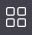
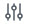

## Install and configure Ricgraph

Ricgraph uses [Neo4j](https://neo4j.com)
as [graph database engine](https://en.wikipedia.org/wiki/Graph_database).
They have several products:

* [Neo4j Desktop](https://neo4j.com/download-center/#desktop);
* [Neo4j Bloom graph visualization tool](https://neo4j.com/product/bloom),
  included with Neo4j Desktop
  (according to Neo4j:
  "A beautiful and expressive data visualization tool to quickly explore and freely interact with
  Neo4j’s graph data platform with no coding required");
* [Neo4j Community Edition](https://neo4j.com/download-center/#community), allows
  to explore the graph using
  [Cypher queries](https://en.wikipedia.org/wiki/Cypher_(query_language)) only.

The easiest method for using Ricgraph is by using a virtual machine (VM) such as
[VirtualBox](https://www.virtualbox.org). A VM of size 25GB with 4GB memory will work.
Of course, this depends on the (size of the) sources you plan to harvest and the
capabilities of your computer. The more, the better. The author uses a VM of 35GB with
8GB memory and 3 vCPUs on an 11th gen Intel i7 mobile processor. Ricgraph has been
developed with Python 3.11, but there are reports that Ricgraph will work with Python 3.6.9.
Other things you need to do:

1. [Install Neo4j Desktop](#install-neo4j-desktop) (recommended, since it includes Bloom).
1. [Install the Bloom configuration](#install-bloom-configuration).
1. [Download this Ricgraph repository](#download-ricgraph).
1. [Use a Python virtual environment](#use-a-python-virtual-environment).
1. [Install the Python requirements](#install-the-python-requirements).
1. Create and update the [Ricgraph initialization file](#Ricgraph-initialization-file).
1. Start 
   - harvesting data, see [Ricgraph harvest scripts](ricgraph_harvest_scripts.md);
   - writing scripts, see [Ricgraph script writing](ricgraph_script_writing.md).
1. [Execute queries and visualize the results](ricgraph_query_visualize.md).

Other things you might want to do:
1. [Create a Neo4j Desktop database dump of Ricgraph](#create-a-neo4j-desktop-database-dump-of-ricgraph).
1. [Restore a Neo4j Desktop database dump of Ricgraph](#restore-a-neo4j-desktop-database-dump-of-ricgraph).

[Return to main README.md file](../README.md).

### Install Neo4j Desktop

1. Download [Neo4j Desktop](https://neo4j.com/download-center/#desktop) for your
   operating system. For linux it is an [AppImage](https://en.wikipedia.org/wiki/AppImage),
   so it can be installed and used without root permissions. You will be asked to fill in a form before
   you can download. In the following screen you will be given a "Neo4j Desktop Activation Key". Save it.
1. The downloaded file is called something
   like *neo4j-desktop-X.Y.Z-x86_64.AppImage*, where *X.Y.Z* is a version number.
   Make it executable using "chmod 755 \[filename\]". Then click on it.
1. Accept the license, and then enter your activation key in the right part of the screen. Click "Activate".
   You might have to wait awhile before you can continue to the next step.
1. Move your mouse to "Example Project" in the left column.
   A red trash can icon appears. Click it to remove the Example
   Project database "Movie DBMS". Confirm.
1. The text "No projects found" will appear. Create a project by clicking the button "+ New Project".
1. The text "Project" appears with the text "Add a DBMS to get started". Click on the "+ Add" button
   next to it and select "Local DBMS". Leave the name as it is ("Graph DBMS") and fill in a password. Choose
   an easy to type and short one
   since the DBMS will only be accessible from your own machine. Click "Create".
   Also, insert the password in field *neo4j_password* in
   the [Ricgraph initialization file](#Ricgraph-initialization-file), see below.
1. Exit Neo4j Desktop using the "File" menu and select "Quit". If your database was active
   a message similar to "Your DBMS [name] is running, are you sure you want to quit" appears,
   choose "Stop DBMS, then quit".
1. Ready.

Now we need to find the port number which Neo4j Desktop is using:

1. [Start Neo4j Desktop](ricgraph_query_visualize.md#start-neo4j-desktop).
1. Click on the words "Graph DBMS". At the right a new screen appears.
   Look at the tab "Details". Note the port number next to "Bolt port" (the default
   value is 7687).
   Insert this port number in field *neo4j_port* in
   the [Ricgraph initialization file](#Ricgraph-initialization-file), see below.
1. Ready.

### Install Bloom configuration

1. [Start Neo4j Desktop](ricgraph_query_visualize.md#start-neo4j-desktop).
1. Click on the icon 
   on the left side of Neo4j Desktop.
1. Click on "Neo4j Bloom". A new window appears.
1. In this window, click on the icon 
   at the top left. A Bloom "Perspective" slides out
   (Neo4j has an
   [extensive description how to
   use it](https://neo4j.com/docs/bloom-user-guide/current/bloom-visual-tour/perspective-drawer)).
1. Click on "neo4j > Untitled Perspective 1".
1. A new window appears.
   Right of the words "Untitled Perspective 1" there are three vertical dots. Click on it.
   Click on "Delete". The perspective "Untitled Perspective 1" is removed.
1. In the same window, right of the word "Perspectives" click on the word "Import".
   A file open window appears. Go to directory
   [neo4j_config](../neo4j_config) that is part of Ricgraph and
   select file *ricgraph_bloom_config.json*. Click "Open".
   The perspective "ricgraph_bloom_config" is loaded.
1. Click on the text "ricgraph_bloom_config".
1. Note that the text "neo4j > Untitled Perspective 1"
   has been changed in "neo4j > ricgraph_bloom_config".
1. A few centimeters below "neo4j > ricgraph_bloom_config", just below the text "Add category",
   click on the oval "RicgraphNode". At the right, a new window will appear.
1. In this window, below the word "Labels", check if an oval box with the text "RicgraphNode" is
   shown. If not, click on "Add labels", click on "RicgraphNode".
1. Click on the icon 
   to go back to the main screen of Bloom.
1. Ready.

### Download Ricgraph

You can choose two types of downloads for Ricgraph:

* The latest released version. Go to the
  [Release page of Ricgraph](https://github.com/UtrechtUniversity/ricgraph/releases),
  choose the most recent version, download either the *zip* or *tar.gz* version.
* The "cutting edge" version. Go to the
  [GitHub page of Ricgraph](https://github.com/UtrechtUniversity/ricgraph/),
  click the green button "Code", choose tab "Local", choose "Download zip".

### Use a Python virtual environment

To be able to use Ricgraph, you will need a Python virtual environment.
Virtual environments are a kind of lightweight Python environments,
each with their own independent set of Python packages installed
in their site directories. A virtual environment is created on top of
an existing Python installation.
There are two ways of doing this:

* Using Python's venv module.
  [Read this primer to learn how to do
  this](https://realpython.com/python-virtual-environments-a-primer/).
* Use a Python
  [Integrated development
  environment (IDE)](https://en.wikipedia.org/wiki/Integrated_development_environment),
  such as [PyCharm](https://www.jetbrains.com/pycharm).
  An IDE will automatically generate a virtual environment, and any time you
  use the IDE, it will "transfer" you to that virtual environment.
  It is also helps to execute and debug your scripts.

### Install the Python requirements

Ricgraph is dependent on a number of Python modules,
such as [Py2neo](#Py2neo) and [PyAlex](#PyAlex).
They are listed in the file *requirements.txt*.
You can install these in different ways:

* If you use a virtual environment, in the virtual environment, type
  `pip install -r requirements.txt`.
* If you use a Python IDE (see previous paragraph), depending on the IDE,
  single or double-click on
  file *requirements.txt*. Somewhere, there will appear a button or text
  with something like "Install requirements". Click on it.

#### Py2neo

Ricgraph uses [Py2neo](https://py2neo.org). Py2neo is (according to its author) "a client library
and toolkit for working with Neo4j from within
Python applications and from the command line.
The library supports both Bolt and HTTP and provides a high level
API, an OGM, admin tools, an interactive console, a
Cypher lexer for Pygments, and many other bells and whistles."

#### PyAlex

Ricgraph uses [PyAlex](https://github.com/J535D165/pyalex).
PyAlex is a Python library for [OpenAlex](https://openalex.org/).
OpenAlex is an index of hundreds of millions of interconnected scholarly papers, authors,
institutions, and more. OpenAlex offers a robust, open, and free [REST API](https://docs.openalex.org/)
to extract, aggregate, or search scholarly data.
PyAlex is a lightweight and thin Python interface to this API.

### Ricgraph initialization file

Ricgraph requires an initialization file. A sample file is included as *ricgraph.ini-sample*.
You need to copy this file to *ricgraph.ini* and modify it by including a password and
a port number for Neo4j Desktop, and API keys or email addresses for other systems you plan to use.
Optionally, you can extend Ricgraph by adding new
[properties of nodes](ricgraph_details.md#Properties-of-nodes-in-Ricgraph).
Before you can do this, [download Ricgraph](#download-ricgraph).

#### RICGRAPH_NODEADD_MODE
There is a parameter *RICGRAPH_NODEADD_MODE* in the initialization file 
which influences how nodes are added to Ricgraph. Suppose we harvest a source system
and that results in the following table:

| FULL_NAME | ORCID               |
|-----------|---------------------|
| Name-1    | 0000-0001-1111-1111 |
| Name-2    | 0000-0001-1111-2222 |
| Name-3    | 0000-0001-1111-2222 |
| Name-4    | 0000-0001-1111-3333 |

*Name-2* and *Name-3* have the same ORCID. This may be correct, e.g. if *Name-2* is a name variant
of *Name-3*, e.g. *John Doe* vs *J. Doe*, but it also may not be correct, e.g. if 
*Name-2* is *John* and *Name-3* is *Peter* (possibly caused by a typing mistake in a
source system). There is no way for Ricgraph to know which of these two options it is.

RICGRAPH_NODEADD_MODE can be either *strict* or *lenient*:
* *strict* (default setting): only add nodes to Ricgraph which conform to the model
  described in the [Implementation details](ricgraph_details.md). 
  In the example above, *ORCID* *0000-0001-1111-2222* will not be inserted.
* *lenient*: add every node.
  In the example above, *ORCID* *0000-0001-1111-2222* will be inserted.

This will have the following consequences: 
* *strict*: since *ORCID* *0000-0001-1111-2222* 
  will not be inserted, a research output from a person with
  that *ORCID* may not be inserted in Ricgraph. Or the research output will be inserted,
  but it might not be linked to the person with this *ORCID*.
* *lenient*: as has been described [Implementation details](ricgraph_details.md), *person-root*
  "represents" a person. Person identifiers (such as *ORCID*) 
  and research outputs are connected to the
  *person-root* node of a person. 
  That means that the *person-root* node is connected to everything a person has contributed to. 
 
  In the example above, *ORCID* *0000-0001-1111-2222* 
  is inserted. That means that the *person-root*s of the two persons 
  *Name-2* or *Name-3* are "merged" and
  that all research outputs of *Name-2* and *Name-3* will be connected to one *person-root* node.
  After this has been done, there is no way to know which research output belongs to
  *Name-2* or *Name-3*. 
 
  As said, that is fine if *Name-2* and *Name-3* are name variants,
  but not fine if they are different names.
  (Side note: if you want to capture spelling variants, you may want to use a fuzzy string match library
  such as [TheFuzz](https://github.com/seatgeek/thefuzz).)

*Lenient* is advisable if the sources you harvest from do not contain errors. However, the author
of Ricgraph has noticed that this does not occur often, therefore the default is *strict*.

### Using Ricgraph
Before you can do anything with Ricgraph, you need to harvest sources,
see [Ricgraph harvest scripts](ricgraph_harvest_scripts.md).
After you have harvested sources, you can execute queries and visualize the results,
see [Query and visualize Ricgraph](ricgraph_query_visualize.md).

### Create a Neo4j Desktop database dump of Ricgraph
To create a Neo4j Desktop database dump of Ricgraph, follow these steps:
1. Start Neo4j Desktop if it is not running, or
   stop the graph database if it is running.
1. Hoover over the name of your graph database (probably "Graph DBMS"),
   and click on the three horizontal dots at the right.
1. Select "Dump".
1. Your graph database will be dumped. This may take a while. When it
   is ready, a message appears.
1. Ready.

### Restore a Neo4j Desktop database dump of Ricgraph
To restore a 
[Neo4j Desktop database dump of Ricgraph](#create-a-neo4j-desktop-database-dump-of-ricgraph), 
follow these steps:
1. Start Neo4j Desktop if it is not running, or 
   stop the graph database if it is running.
1. Click on the button "Add" on the right side of "Project" and select "File".
1. Select the file "neo4j.dump" from a previous Neo4j Desktop database dump.
   This file will be added to the "File" section a little down the "Project" window.
1. Hoover over this file and click on the three horizontal dots at the right.
1. Select "Create new DBMS from dump".
1. Give it a name, e.g. "Graph DBMS from import file".
1. When asked, enter the password you have specified in 
   the [Ricgraph initialization file](#ricgraph-initialization-file)
   (this saves you from entering a new password in that file).
1. A new local graph database is being created. This may take a while.
1. Hoover over the newly created graph database and click "Start" to run it.
1. Once it is active, [install the Bloom configuration](#install-bloom-configuration).
1. Now you are ready to explore the data 
   using [Bloom](ricgraph_query_visualize.md#how-to-use-bloom)
   or [Ricgraph Explorer](ricgraph_query_visualize.md#how-to-use-ricgraph-explorer).

### Return to main README.md file

[Return to main README.md file](../README.md). 

