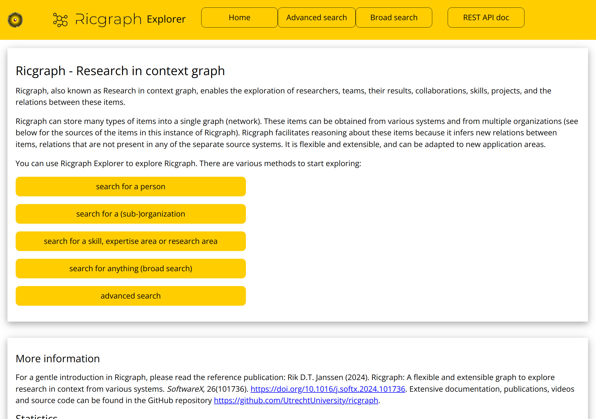

## Ricgraph REST API


data or predefined queries in Ricgraph, 
in such a way that your code is not dependent on any Ricgraph 
code. In your own code, you do not need to include any of the Ricgraph dependencies, nor 
include *ricgraph.py* or *ricgraph_explorer.py*.
You can use the Ricgraph REST API to programmatically get items from Ricgraph,
as an alternative to using the user
interface [Ricgraph Explorer](ricgraph_explorer.md). 

Note that this will only work if someone has a running Ricgraph and
Ricgraph Explorer instance available, which you can access over the web.
That someone can be yourself, who has Ricgraph and
Ricgraph Explorer running on your own computer or e.g. on SURF Research Cloud,
or can be someone else, who has done that.

If you use the Ricgraph REST API, will get these results 
in a [JSON format](https://en.wikipedia.org/wiki/JSON).
The Ricgraph REST API uses 
the [OpenAPI standard](https://www.openapis.org).
It gives access to Ricgraph function calls both in *ricgraph.py* 
and in *ricgraph_explorer.py*. 
Read more about 
[REST (representational state transfer)](https://en.wikipedia.org/wiki/REST), or
read more about 
[API (application programming interface)](https://en.wikipedia.org/wiki/API).

On this page, you can learn more about:
* [Installation of the Ricgraph REST API](#installation-of-the-ricgraph-rest-api).
* [Use of the Ricgraph REST API](#use-of-the-ricgraph-rest-api).

[Return to main README.md file](../README.md).


### Installation of the Ricgraph REST API
The Ricgraph REST API is part of Ricgraph Explorer. Read [how to start Ricgraph 
  Explorer](ricgraph_explorer.md#how-to-start-ricgraph-explorer).

Depending on your needs, you might also want to read:
* [Install and use a service unit file to run Ricgraph Explorer and the Ricgraph REST 
  API](ricgraph_as_server.md#use-a-service-unit-file-to-run-ricgraph-explorer-and-the-ricgraph-rest-api).
* [Use Apache, WSGI, and ASGI to make Ricgraph Explorer and the Ricgraph
  REST API accessible from outside your virtual 
  machine](ricgraph_as_server.md#use-apache-wsgi-and-asgi-to-make-ricgraph-explorer-and-the-ricgraph-rest-api-accessible-from-outside-your-virtual-machine).


### Use of the Ricgraph REST API
A call to a REST API consists of a hostname, sometimes a port number, 
the path */api/*, followed
by a REST API endpoint.
For example, in
```
http://127.0.0.1:3030/api/person/search?value=John+Doe
```
*/person/search* is the endpoint, *value* the name of a query parameter to the REST API,
and *John+Doe* the value for the query parameter.

You can use the online documentation in Ricgraph Explorer
for the REST API. It lists the various endpoints
and parameters, and you can try out each endpoint with values for parameters as you like.
To do this, click the "REST API doc" button in the top bar of 
Ricgraph Explorer, and you will get an explanation how to do this.
See the figure below, that shows part of the Home page of Ricgraph Explorer 
(click on it to enlarge).



As an alternative, you can also read 
the [Ricgraph REST API documentation page](ricgraph_restapi_gendoc.md),
that is auto generated from the OpenAPI yaml specification file, but
it only lists the end points and parameters available and there is no
try out feature.


#### How to generate the Ricgraph REST API documentation page
This page is auto generated using 
[openapi-to-md](https://github.com/SoraKumo001/openapi-to-md).
To auto generate it, follow these steps:
* If not installed, as root user, install *npm* using the package installer of your Linux.
* Go to your home directory, type:
  ```
  cd
  ```
* As a normal (non-root) user, install *openapi-to-md*, type:
  ```
  npm i openapi-to-md
  ```
  This will install openapi-to-md in subdirectory *node_modules* of your home directory.
* Go to your Ricgraph installation directory, probably named *[some path]/ricgraph*.
  Type:
  ```
  ~/node_modules/.bin/openapi-to-md ricgraph_explorer/static/openapi.yaml > docs/ricgraph_restapi_gendoc.md
  ```
* Done.


### Return to main README.md file
[Return to main README.md file](../README.md).

