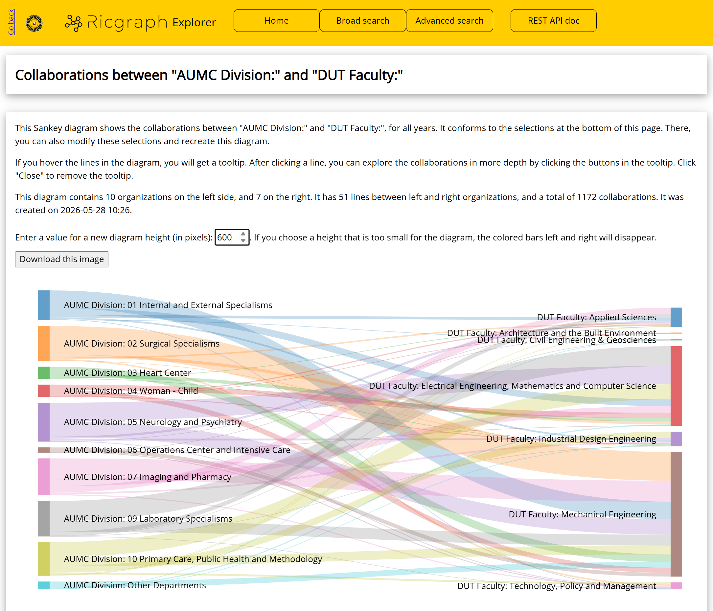
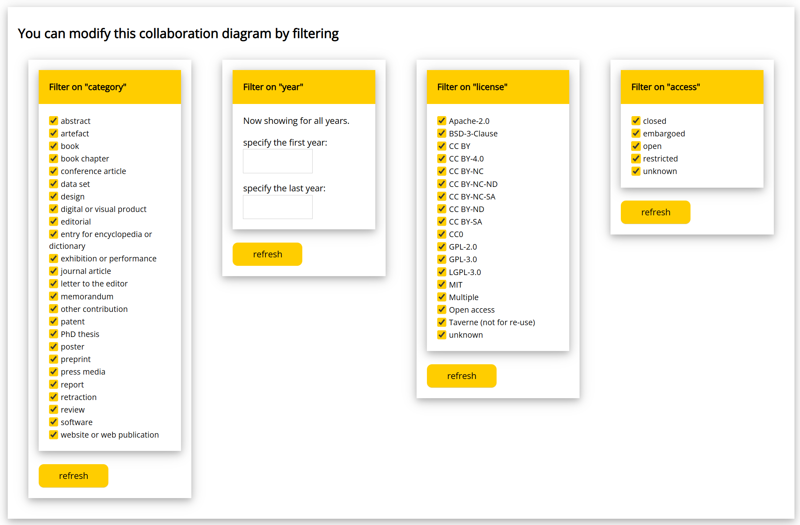

# Explore collaborations between (sub-)organizations with Ricgraph

## Introduction

Using Ricgraph, you can explore collaborations between (sub-)organizations.
You can also filter them on categories of research results
(e.g., *journal article*, *data set*, *software*, etc.),
year, license, and/or access.

You may want to do that, because
researchers rarely work alone: they work with colleagues within and between
organizations on all organizational levels. They collaborate on a variety of
research results beyond traditional publications. However, collaboration
indicators in research assessment usually rely on a single source, focus on
top‑level institutions, and may focus on journal articles only. This limits
what can be seen about collaborations within organizations, and for results
such as data sets and software.

Ricgraph offers a 
multi‑source, multi-level, graph‑based approach to
collaboration indicators.
Publications, data sets, software, persons, and organizational information from
multiple systems are integrated into a single graph. Collaborations are defined
as shared research results connecting organizations via persons. They are
quantified on top-level organization, as well as on faculty and departmental
level, providing a concrete operationalization of multi‑source, multi‑level
collaboration indicators for science‑of‑science research.

Combining multiple sources substantially increases the observed coverage of
collaborations, especially for data set and software collaborations.

You can read more in Rik D.T. Janssen (2025).
*Utilizing Ricgraph to gain insights into research collaborations across institutions,
at every organizational level*. [preprint].
[https://doi.org/10.2139/ssrn.5524439](https://doi.org/10.2139/ssrn.5524439).
A journal article of a revised version of this preprint is in review.

## How to do this?

* Go to [Use Ricgraph](pilot-project-open-ricgraph-demo-server.md) to find
  the link to the Open Ricgraph demo server.
* Click "explore collaborations". You will get to a page that explains
  what you can do and how it works.
* Choose a *start organization*, and (optional) a *collaborating organization*. 
* Choose whether you want to restrict the collaborations to research results
  of a specific category (e.g., only show collaborations related to 
  *journal articles*, *data sets*, or *software*).
* Choose how you want to explore the collaborations.

If you choose the Sankey diagram, with
*start organization* = *AUMC Division:* and
*collaborating organization* = *DUT Faculty:*
(AUMC = Amsterdam University Medical Centers, DUT = Delft University of Technology),
you will get a diagram
with the collaborations between those sub-organizations,
as in the following image (it will very probably differ, since new
research results will have been added since this screenshot was made in May 2026).

If you hover the lines in the diagram (in Ricgraph, not in the image above), 
you will get a tooltip. 
After clicking a line, you can explore the collaborations in more depth.
This means, that for every collaboration,
you can explore its research results, and the persons from both sub-organizations 
that were involved in that collaboration (on the left and right side of the diagram).

You can modify this diagram by filtering on *category*, *year*, *license*,
and *access*:

After you click "refresh", the collaboration diagram will be regenerated.
This means that you can create collaboration diagrams for a number of (sub-)organizations,
and compare these over a number of years, or on their access value (or on
other filters).
Or both: you can explore how the access value of research results that 
lie at the basis of the collaborations varies over the years.

## Next steps
Read about [Open science with Ricgraph](open-science-with-ricgraph.md).
Go to the [contact page](contact.md).
