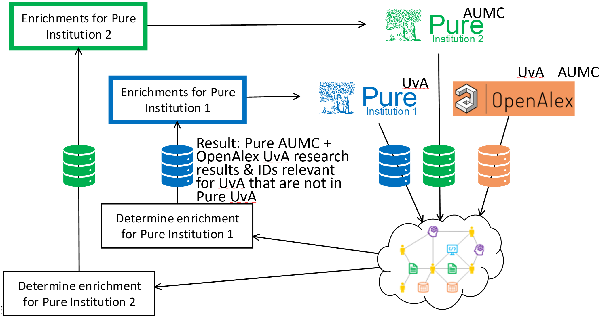

# Enhance research information systems with Ricgraph

## Introduction

Using Ricgraph in combination with
[BackToPure](https://github.com/UtrechtUniversity/BackToPure/tree/jobs-orientied),
you can enhance an organization's
[Research Information System Pure](https://www.elsevier.com/solutions/pure)
by identifying candidate research results, data sets, software, and identifiers
that are present in external sources but missing from that
organization's own Pure system.

Ricgraph connects information from multiple source systems and organizations in
a single graph. BackToPure can use these relations to find candidate
enrichments and, after review, insert or update them in Pure. The result is a
more complete and better connected overview of research for that organization.

In an image, this looks as follows:

Suppose your organization is UvA (Universiteit van Amsterdam), and you would
like to enhance your Pure (Pure UvA). 
Also, suppose the Pure system of another organization, Pure AUMC 
(Amsterdam University Medical Centers) has been harvested in Ricgraph. 
In addition, OpenAlex for both UvA en AUMC has been harvested.
In the figure, Ricgraph is shown at the bottom right (the cloud).

Ricgraph can then be used, together with BackToPure, to identify candidate
research results and identifiers from Pure AUMC and OpenAlex that are
relevant for UvA, but not yet present in Pure UvA. These candidates may be
relevant, because they are related to UvA researchers,
UvA research results, UvA person identifiers, etc.

After review, BackToPure can feed these candidate enrichments back into Pure
UvA via the blue “enrichments” box.

## How to do this?

For this to work, you will need either 

* the REST API of the Open Ricgraph demo server, and
  your organization has to be included in the Open Ricgraph demo server, or
* your own installation of Ricgraph, where you have harvested sources relevant
  for your organization.

and a local BackToPure installation.

If you would like to do this, please contact us
using the [contact page](contact.md).

## Next steps
Read about using or participating in Ricgraph
with the [Pilot project Open Ricgraph demo 
server](pilot-project-open-ricgraph-demo-server.md).
Go to the [Contact page](contact.md).
