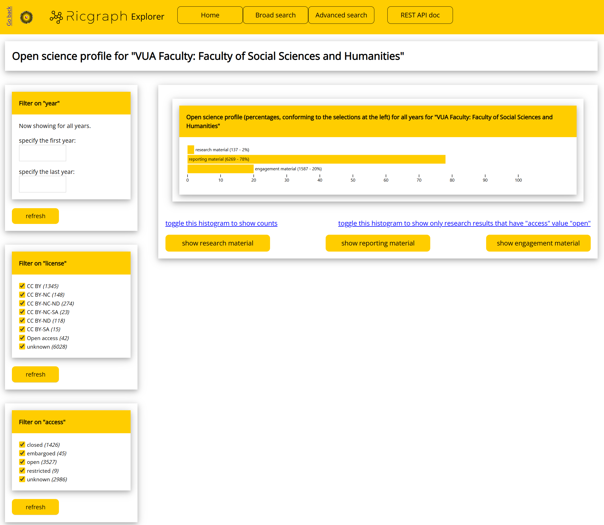
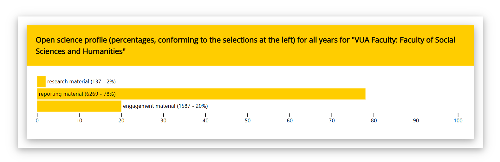
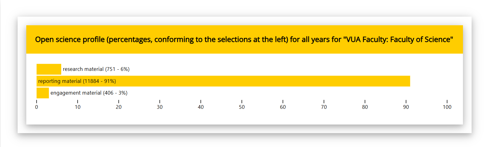
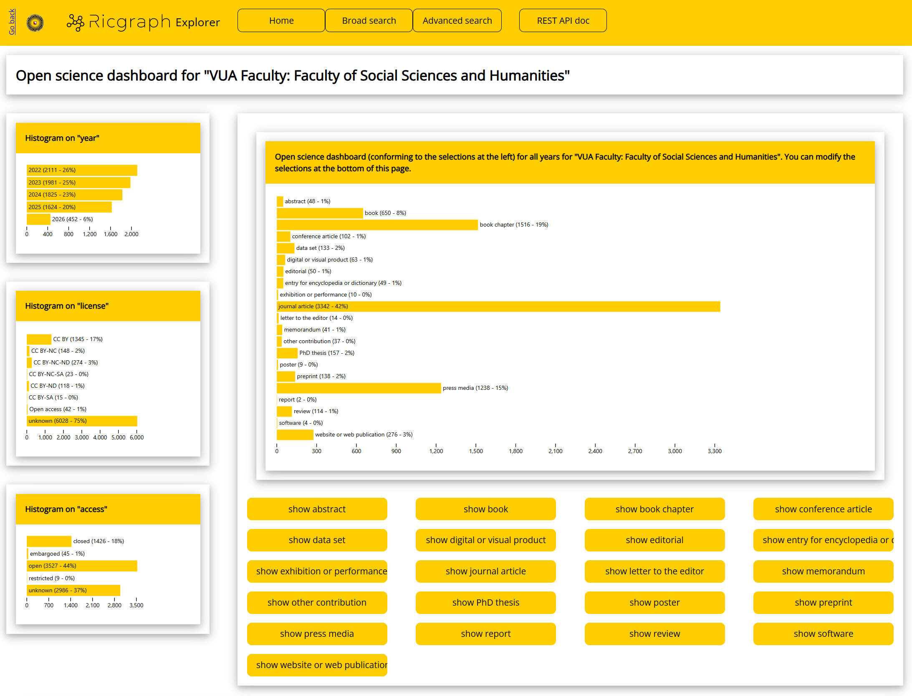
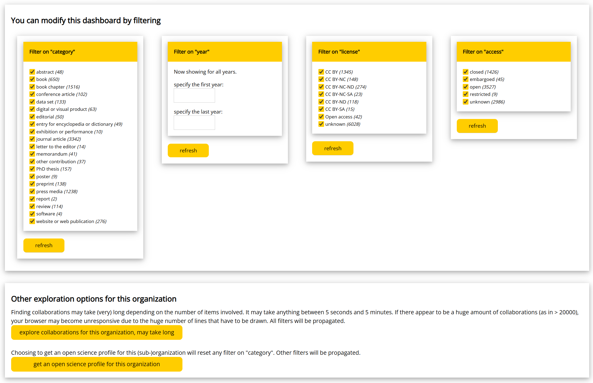

# Explore the open science landscape with Ricgraph

At the moment, Ricgraph offers three options to explore the open
science landscape:

* [Get an Open science profile for a 
  (sub-)organization](#get-an-open-science-profile-for-a-sub-organization).
* [Get an Open science dashboard for a 
  (sub-)organization](#get-an-open-science-dashboard-for-a-sub-organization).
* [Explore collaborations between (sub-)organizations with
  Ricgraph](collaborations-with-ricgraph.md).

The nice thing
about Ricgraph is that anyone with Python knowledge can easily extend it.
That means, that if you have an idea for an open science
indicator, you can implement it in Ricgraph. Then, you can apply it to your own
research information (and to research information from other organizations,
if you have it), and assess it actual usefulness.
If you are experienced with Python and Ricgraph, implementing such an
indicator can be done in a few days.

## Get an Open science profile for a (sub-)organization

In Ricgraph, an Open science profile relates to the distribution of research
results for a certain (sub-)organization, in the three groups 
*research material*, *reporting material*, and *engagement material*. 
It is said that the form
of this distribution may be characteristic for such a (sub-)organization. 
It is possible to filter on year, license, and/or access.

These three groups are defined as: 

* *Research material*: input/output and supporting
  material of the research.
  E.g., the research result categories *data set*, *software*.
* *Reporting material*: documents reporting on process and results of research.
  E.g., the research result categories *book*, *conference article*, 
  *journal article*, etc.
* *Engagement material*: everything used to involve stakeholders 
  and wider audiences into influencing the research and using 
  or implementing its results.
  E.g., the research result categories *patent*, *press media*, 
  *website or web publication*.

### How to do this?

* Go to [Use Ricgraph](pilot-project-open-ricgraph-demo-server.md) to find
  the link to the Open Ricgraph demo server.
* Click "explore the open science landscape". Then click
  "get an open science profile for a (sub-)organization".
* Type an organization name, or part of it. If there are multiple matches,
  you can choose one.
* You will get an Open science profile for that (sub-)organization.

If you choose "VUA Faculty: Faculty of Social Sciences and Humanities"
(VUA = Vrije Universiteit Amsterdam),
you will get a profile
as in the following image (it will very probably differ, since new
research results will have been added since this screenshot was made in May 2026).
Below the diagram you can click buttons to inspect the research results in
each of the three groups.

As shown in the left part of this figure,
you can modify the Open science profile by filtering on *year*, *license*, and *access*.
The *license* and *access* filters also include counts.

After you click "refresh", the Open science profile will be regenerated.
This means that you can create open science profiles 
and compare these for various years, or on access value (or on
other filters).
Or both: you can explore how the access value of research results 
varies over the years, and how that influences the open science profile.

To assess whether this distribution is characteristic for a sub-organization,
observe the Open science profile
for "VUA Faculty: Faculty of Social Sciences and Humanities":

and for "VUA Faculty: Faculty of Science":

It can be observed that "VUA Faculty: Faculty of Social Sciences and Humanities"
has more *engagement material*. Whether this means something, can only be 
concluded by looking at the strategy of both faculties, the strategy of the
Vrije Universiteit Amsterdam, and by inspecting the research results involved.
Also, the differences can be caused by missing information in the source systems.
So one should take caution by conclusions from these profiles.

## Get an Open science dashboard for a (sub-)organization

In Ricgraph, an Open science dashboard is a histogram of the various categories
of research results for a certain (sub-)organization. It also shows histograms
on year, license, and access.
It is possible to  filter on category, year, license, and/or access.

### How to do this?

* Go to [Use Ricgraph](pilot-project-open-ricgraph-demo-server.md) to find
  the link to the Open Ricgraph demo server.
* Click "explore the open science landscape". Then click
  "get an open science dashboard for a (sub-)organization".
* Type an organization name, or part of it. If there are multiple matches,
  you can choose one.
* You will get an Open science dashboard for that (sub-)organization.

If you choose "VUA Faculty: Faculty of Social Sciences and Humanities"
(VUA = Vrije Universiteit Amsterdam),
you will get a dashboard
as in the following image (it will very probably differ, since new
research results will have been added since this screenshot was made in May 2026).
Below the diagram you can click buttons to inspect the research results 
for each category in the histogram.

Note that it resembles the [Open science profile for a
(sub-)organization](#get-an-open-science-profile-for-a-sub-organization),
but that it uses all categories of research results.
In some cases, the Open science dashboard is what you want, while in others,
you might like the Open science profile.

You can modify this dashboard by filtering on *category*, *year*, *license*,
and *access*:

After you click "refresh", the dashboard will be regenerated.
This means that you can create dashboards for a (sub-)organization,
and compare them over a number of years, or on their access value (or on
other filters).
Or both: you can explore how the access value of research results 
for a (sub-)organization varies over the years.

Below the filters, there are two buttons that provide more insight in the
selected organization:

* [explore collaborations for this organization](collaborations-with-ricgraph.md).
* [get an Open science profile for this
  organization](#get-an-open-science-profile-for-a-sub-organization).

## Next steps
Read about [Enhancing research information systems with Ricgraph](enhancing-with-ricgraph.md).
Go to the [contact page](contact.md).
