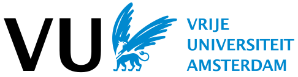

# Pilot project Open Ricgraph demo server

> Anyone can use and explore Ricgraph with research information from the 
> [participating organizations](#participating-organizations).
> Access it via 
> [https://explorer.ricgraph.eu](https://explorer.ricgraph.eu).

This page tells more about
the Pilot project Open Ricgraph demo server.
Rather install and use your own version of Ricgraph with your own 
research information? Go to
[install and use Ricgraph](learn-more-about-ricgraph.md#install-and-use-ricgraph).

## Aim of the pilot project
The aim of the pilot project is to demonstrate how Ricgraph
can provide insights into research relations and collaborations, and how it can
optimize the quality of research information. 

The approach we take is to collect research information from 
[participating organizations](#participating-organizations)
and from 
[multiple source systems](#multiple-source-systems), 
and to combine it in a single
graph.
The result is openly available to anyone, in accordance with the open science
principles. 

By organizing research information in a network of connected items and
relations, users can infer new relations, relations that are not present in any
of the source systems.
Ricgraph is unique because it allows you to:

* [Explore collaborations between (sub-)organizations](collaborations-with-ricgraph.md).
* [Explore open science](open-science-with-ricgraph.md).
* [Enhance research information systems](enhancing-with-ricgraph.md).

## Participating organizations
In this pilot project, we have started with research information from
the following organizations in the Netherlands:

|                       |  |  |
|:------------------------------------------------------------------------------------:|:-------------------------------------------------------------:|:-------------------------------------------------------------:|
| [Amsterdam University Medical Centers](https://www.amsterdamumc.org/en/research.htm) |  [Delft University of Technology](https://www.tudelft.nl/en)  |       [Vrije Universiteit Amsterdam](https://vu.nl/en)        |

More participants will be added during pilot period. If your organization would like to 
participate, read [Participate in the pilot project](#participate-in-the-pilot-project).

## Multiple source systems
The graph for this pilot is constructed
based on the contents of
the [Research Information System Pure](https://www.elsevier.com/solutions/pure) of
each participating organization, supplemented with research information from
sources such as the publication and data set aggregator
[OpenAlex](https://openalex.org),
the data repository [Yoda](https://www.uu.nl/en/research/yoda), and
the [Research Software Directory](https://research-software-directory.org).

## Contents of the pilot
[Utrecht University](https://www.uu.nl/en)
facilitates the participating organizations to construct a graph containing
their research information. It will include information on researchers, teams,
their results, (sub-)organizations, collaborations, (optional) skills,
and the relations between these items. 

The participating organizations explore the potential and investigate
what can be learned from research information in a single graph. 
This project consists of several parts: 

* Utrecht University will make available an Open Ricgraph demo server containing 
  research information from the participating organizations. 
* Participating organizations can enrich Pure data using Ricgraph 
  and [BackToPure](https://github.com/UtrechtUniversity/backtopure). 
  BackToPure can insert (enrich) items from an organization 
  that are absent from the Pure system of that organization but are present in 
  another source, back into the Pure system of that organization.
  Read more at [Enhance research information systems with Ricgraph](enhancing-with-ricgraph.md).
* Participating organizations can explore collaborations between 
  sub-organizations (faculties, departments, chairs) using Ricgraph.
  Read more at [Explore collaborations between (sub-)organizations with
  Ricgraph](collaborations-with-ricgraph.md).
* Anyone can [Explore open science with Ricgraph](open-science-with-ricgraph.md).
* Each organization can also pursue its own goals.

To learn more about the pilot project, please read 
*Discovering insights from cross-organizational research 
information and collaborations: A pilot project using Ricgraph*, 
Rik D.T. Janssen (2025), 
[https://doi.org/10.5281/zenodo.15637647](https://doi.org/10.5281/zenodo.15637647).

## Participate in the pilot project
You can use the Open Ricgraph demo server
by going to the webpage at the top of this page.
If your organization would like to participate, there are three things 
that require your attention:

* Preparation for the pilot.
  * Your organization and Utrecht University need to sign two agreements: 
    an *Agreement to host a pilot Open Ricgraph demo server*, and a 
    *Data Processing Agreement*.
    The effort required for this depends on how closely your organization's 
    insights on legal and privacy policies align with those of the
    already participating organizations.
    You can find more information (including the agreements)
    in section 1.6 and chapter 5 
    of the document above.
  * Your organization needs a *privacy statement* related to this pilot project.
    Possibly the general privacy statement of your organization suffices.
    Your organization might also 
    wish to conduct a *data classification*. 
    These topics are described in chapter 5
    of the document above.
* Execution of the pilot.
  * Someone of your organization needs to participate in the project group, 
    needs time for experimentation, and needs time for sharing findings. 
    In practice, this will take as much time as you are able 
    and willing to allocate, as described in section 1.7
    of the document above.
 
For more information, please [contact Rik D.T. Janssen](contact.md).

## Next steps
Read about [Ricgraph news](ricgraph-news.md).
Go to the [contact page](contact.md).
