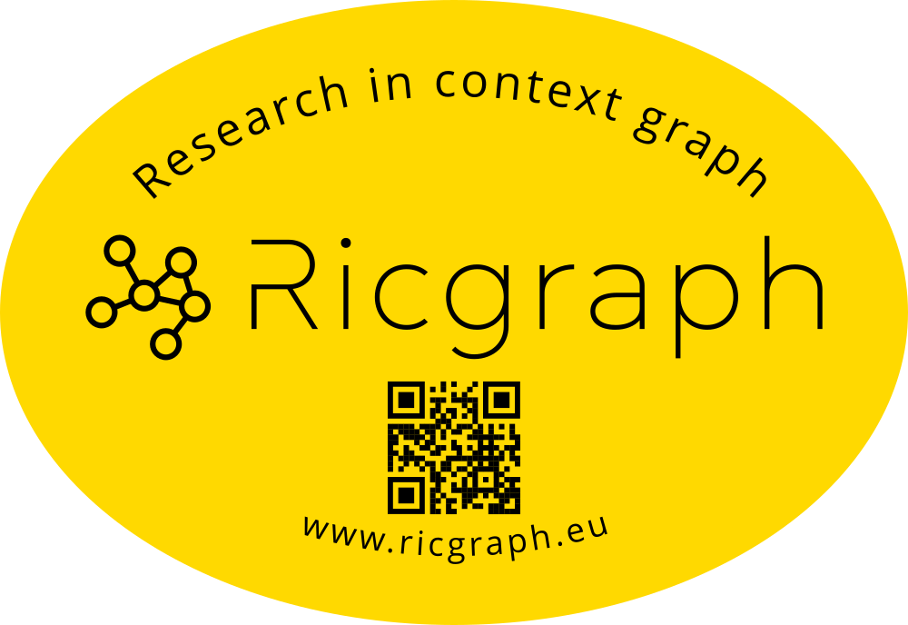

# What is Ricgraph?

Ricgraph, also known as Research in context graph, enables the exploration of researchers, teams, their results,
collaborations, skills, projects, and the relations between these items.

Ricgraph can store many types of items into a single graph. 
These items can be obtained from various systems and from
multiple organizations. Ricgraph facilitates reasoning about these 
items because it infers new relations between items,
relations that are not present in any of the separate source systems. 
It is flexible and extensible, and can be
adapted to new application areas.

Currently, there are people that are working on the following extensions for Ricgraph:

* [BackToPure](https://github.com/UtrechtUniversity/backtopure).
  This is a tool that can enrich
  the [Research Information System Pure](https://www.elsevier.com/solutions/pure)
  of that organization.
  This means that BackToPure can insert (enrich) items from an organization that
  are absent from the Pure of that organization
  but are present in another source, back into the Pure of that organization.
  The result is a more complete overview of research at that organization.
  Status: experimental stage (beta).
* A chatbot that allows you to "talk" to Ricgraph. You can formulate questions in
  plain English, such as "Please give me the research results of the Geosciences
  faculty of Utrecht University?"
  or "With what organizations does that faculty collaborate?".
  It uses a local Large Language Model.
  Status: planning stage (pre-alpha).
* A project that uses
  [AI and Large Language Models to cluster and visualize large amounts of research
  information](https://docs.ricgraph.eu/docs/ricgraph_pubs_pres_news_use_ment.html#ricgraph-projects-with-students).
  It uses *topics* to cluster publications,
  data sets, and software. Using these topics, these research results can
  be grouped, and possibly experts on these topics can be found.
  Status: planning stage (pre-alpha).
* A tool that helps Pure administrators to clean up "external organizations" in Pure.
  Status: planning stage (pre-alpha).

## Motivation
Ricgraph is software that is about
relations between items. These items can be collected from various source 
systems and from multiple organizations. We
explain how Ricgraph works by applying it to the application area 
*research information*. We show the insights that can be
obtained by combining information from various source systems, 
insight arising from new relations that are not present
in each separate source system.

*Research information* is about anything related to research: research 
results, the persons in a research team, their
collaborations, their skills, projects in which they have 
participated, as well as the relations between these entities.
Examples of *research results* are publications, data sets, and software.

These following sections show three use cases that
use different types of information (called *items*):
researchers, skills, publications,
etc. Most often, these types of information are not stored in 
one system, so the use cases may be difficult or
time-consuming to answer. However, by using Ricgraph, these 
use cases (and many others) are easy to answer.

Although the following text illustrates Ricgraph in the application area 
research information, the principle “relations
between items from various source systems” is general, 
so Ricgraph can be used in other application areas.

### Use case for a journalist
As a journalist, I want to find researchers with a certain skill S and their publications,
so that I can interview them for a newspaper article.
Example skills can be: *climate change* or *stem cells*.
The items surrounded by the red line are the solution to this use case.

### Use case for a librarian
As a librarian, I want to enrich my local research information system with research results
from person A that are in other systems (in orange, *RIS2*) but not in
ours (in green, *RIS1*), so that we have a more complete view of research at our university.
The items surrounded by the red line are the solution to this use case.

 

### Use case for a researcher
As a researcher A, I want to find researchers from other universities that have
co-authored publications written by the co-authors of my own publications,
so that I can read their publications to find out if we share common research interests.
The items surrounded by the red line are the solution to this use case.

## Main contributions of Ricgraph

* Ricgraph can store many types of items in a single graph.
* Ricgraph harvests multiple source systems into a single graph.
* Ricgraph Explorer is the exploration tool for Ricgraph.
* Ricgraph facilitates reasoning about items because it infers new relations between items.
* Ricgraph can be tailored for an application area.

## More information
You might want to continue reading at 
[Learn more about Ricgraph](learn-more-about-ricgraph.md), 
to [Read more about Ricgraph](read-more-about-ricgraph.md), 
or to [Get Ricgraph](get-ricgraph.md).

{width=35%}
