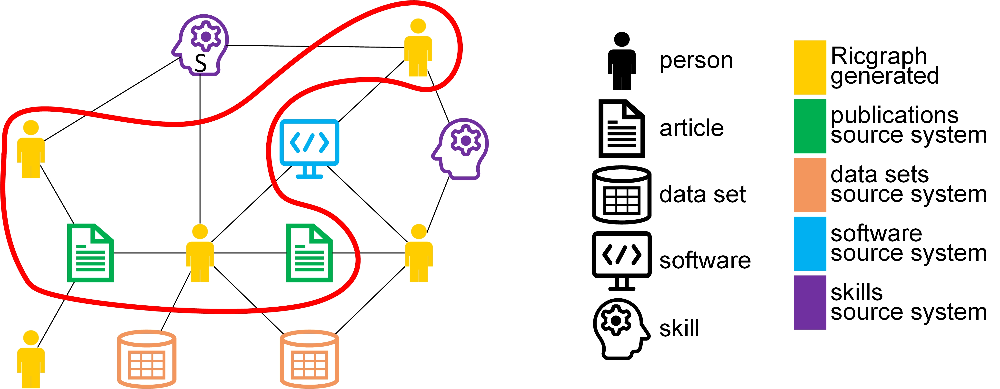
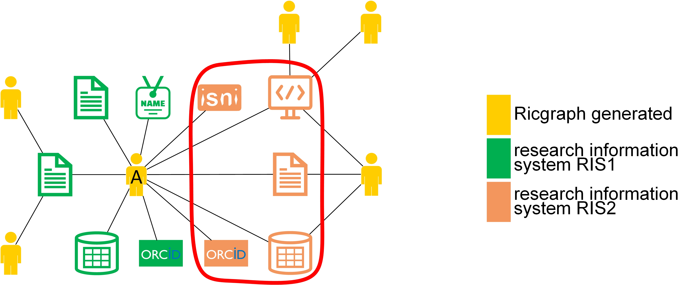
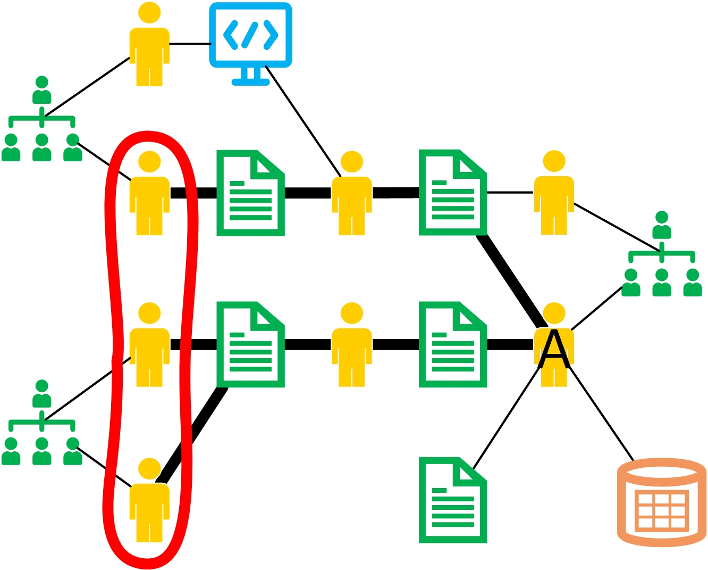
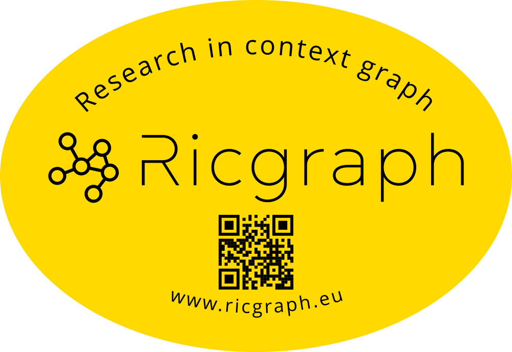

# What is Ricgraph?

> Quick links: [Use or participate](pilot-project-open-ricgraph-demo-server.md) &
> [Read news](ricgraph-news.md).

Ricgraph, also known as Research in context graph, enables the exploration of researchers, teams, their results,
collaborations, skills, projects, and the relations between these items.

Ricgraph can store many types of items into a single graph. 
These items can be obtained from various systems and from
multiple organizations. Ricgraph facilitates reasoning about these 
items because it infers new relations between items,
relations that are not present in any of the separate source systems. 
It is flexible and extensible, and can be
adapted to new application areas.

## Why Ricgraph is unique

Ricgraph is unique because it allows you to:

* [Explore collaborations between (sub-)organizations with
  Ricgraph](collaborations-with-ricgraph.md).
* [Explore Open science with Ricgraph](open-science-with-ricgraph.md).
* [Enhance research information systems with Ricgraph](enhancing-with-ricgraph.md).

The nice thing
about Ricgraph is that anyone with Python knowledge can easily extend it,
so you can use Ricgraph to test your own ideas or to create your own applications.

You can use Ricgraph either as a standalone tool,
or as a component that provides a graph based data structure with
a number of handy tools.
Ricgraph has been developed for the application area 
[research information](#research-information),
and it can be used for other application areas that require
relations between items from various source systems.
[Read more about various other use cases](#use-cases-for-ricgraph).

## Ricgraph videos

You may want to watch the following videos about Ricgraph. The left one is a
short video, only including the Ricgraph use cases. The right one is a more
extensive one (also including the use cases).

<table>
  <tr>
    <td style="width:50%;"><b>Ricgraph use cases video (1m30s)</b></td>
    <td style="width:50%;"><b>Ricgraph introduction video including use cases (2m28s)</b></td>
  </tr>
  <tr>
    <td><video src="https://docs.ricgraph.eu/docs/videos/ricgraph_usecases.mp4" controls width="90%">Ricgraph use cases video (1m30s)</video></td>
    <td><video src="https://docs.ricgraph.eu/docs/videos/ricgraph_intro_usecases.mp4" controls width="90%">Ricgraph introduction video including use cases (2m28s)</video></td>
  </tr>
  <tr>
   <td>
     <a href="https://docs.ricgraph.eu/docs/videos/ricgraph_usecases.mp4" target="_blank">
     Click to play or download the Ricgraph use cases video</a>.
   </td>
   <td>
     <a href="https://docs.ricgraph.eu/docs/videos/ricgraph_intro_usecases.mp4" target="_blank">
     Click to play or download the Ricgraph introduction video</a>.
   </td>
  </tr>
</table>

## Research information
Ricgraph is software that is about
relations between items. These items can be collected from various source 
systems and from multiple organizations. Throughout this website,
we explain how Ricgraph works by applying it to the application area 
*research information*. We show the insights that can be
obtained by combining information from various source systems, 
insight arising from new relations that are not present
in each separate source system.

*Research information* is about anything related to research: research 
results, the persons in a research team, their
collaborations, their skills, projects in which they have 
participated, as well as the relations between these entities.
Examples of *research results* are publications, data sets, and software.

These following section shows three use cases that
use different types of information (called *items*):
researchers, skills, publications,
etc. Most often, these types of information are not stored in 
one system, so the use cases may be difficult or
time-consuming to answer. However, by using Ricgraph, these 
use cases (and many others) are easy to answer.

## Use cases for Ricgraph

### Use case for a journalist
As a journalist, I want to find researchers with a certain skill S and their publications,
so that I can interview them for a newspaper article.
Example skills can be: *climate change* or *stem cells*.
The items surrounded by the red line are the solution to this use case.

### Use case for a librarian
As a librarian, I want to enrich my local research information system with research results
from person A that are in other systems (in orange, *RIS2*) but not in
ours (in green, *RIS1*), so that we have a more complete view of research at our university.
The items surrounded by the red line are the solution to this use case.

 

### Use case for a researcher
As a researcher A, I want to find researchers from other universities that have
co-authored publications written by the co-authors of my own publications,
so that I can read their publications to find out if we share common research interests.
The items surrounded by the red line are the solution to this use case.

## Main contributions of Ricgraph

* [You can explore collaborations between (sub-)organizations with
  Ricgraph](collaborations-with-ricgraph.md).
* [You can explore the open science landscape with Ricgraph](open-science-with-ricgraph.md).
* [You can enhance research information systems with Ricgraph](enhancing-with-ricgraph.md).
* Ricgraph can store many types of items in a single graph.
* Ricgraph harvests multiple source systems into a single graph.
* Ricgraph Explorer is the exploration tool for Ricgraph.
* Ricgraph facilitates reasoning about items because it infers new relations between items.
* You can extend Ricgraph.

## Next steps
Read about [explore collaborations between (sub-)organizations with
Ricgraph](collaborations-with-ricgraph.md).
Go to the [Contact page](contact.md).

